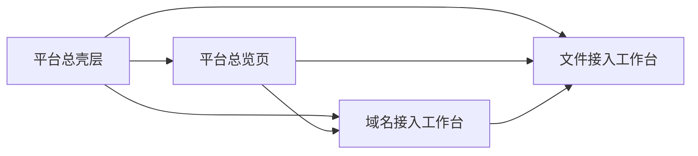

# 统一运维平台低保真原型（2026-03-20）

> 文档状态：现行低保真原型  
> 适用范围：统一控制台的信息架构、页面分区、模块入口与后续 UI 原型设计  
> 对齐口径：以 `docs/02-架构设计/统一运维平台架构草图-2026-03-20.md` 为基线，并与主线能力、阶段边界保持一致

## 1. 本文目的

这份文档不是最终 UI 设计稿，而是“低保真页面原型”。

它要解决的是下面几个问题：

1. 平台首页、主工作台、接入入口应该怎么排版。
2. 当前主线能力和支撑能力在页面里应该放在哪。
3. 后续如果做高保真 UI，应该先从哪几张页面开始。
4. 如何避免页面结构和当前系统规划脱节。

## 2. 原型范围

本次先给出 4 张低保真原型：

1. 平台总壳层
2. 平台总览页
3. 文件接入工作台
4. 域名接入工作台

这 4 张是当前最值得先定下来的，因为它们分别对应：

- 平台统一入口
- 值班首页
- 当前主线核心工作台
- 下一步纳管与接入入口

## 3. 平台总壳层

### 3.1 页面目标

把平台导航、全局筛选、当前值班上下文和页面内容区统一起来。

要求：

- 不再依赖“大块左侧侧边栏”
- 使用顶部一级导航
- 页面内部再使用二级导航 / 筛选条
- 详情优先通过右侧抽屉或页内详情区承接

### 3.2 低保真框图

```text
┌──────────────────────────────────────────────────────────────────────────────────────────────┐
│ GWF                                                                                         │
│ 总览 | 告警中心 | 事件工作台 | 文件接入 | 域名接入 | 系统台账 | 知识库 | 控制面              │
│----------------------------------------------------------------------------------------------│
│ 全局搜索 | 环境：全部/prod/test/temp | 时间范围：实时/24h/7d | 当前值班人 | 通知              │
├──────────────────────────────────────────────────────────────────────────────────────────────┤
│ 页面标题 + 页面说明                                                                          │
│ 二级 Tab / 页面筛选条                                                                        │
├──────────────────────────────────────────────────────────────────────────────────────────────┤
│ 页面内容区                                                                                   │
│                                                                                              │
│  - 列表页：列表 + 右侧详情抽屉                                                               │
│  - 工作台页：左中右分栏 / 上下分区                                                           │
│  - 概览页：状态条 + 图表 + 待办                                                              │
└──────────────────────────────────────────────────────────────────────────────────────────────┘
```

### 3.3 顶部导航与当前规划的映射

| 顶部导航 | 对应规划 | 当前阶段定位 |
| --- | --- | --- |
| 总览 | 统一控制台闭环 | 主入口 |
| 告警中心 | 告警决策 | 主线 |
| 事件工作台 | 发现 -> 诊断 -> 回放 -> 追溯 | 主线 |
| 文件接入 | 文件入云 | 主线 |
| 域名接入 | 域名驱动接入原型 | A 类切口 |
| 系统台账 | 多环境纳管方案 | A/B 过渡 |
| 知识库 | 知识复用 | 主线 |
| 控制面 | Agent / Task / Audit | 支撑 |

### 3.4 建议的交互原则

1. 一级导航只切“平台工作域”，不切页面小模块。
2. 每个页面内部再用 Tab 或筛选条，不把所有层级都挤在一起。
3. 详情优先用抽屉承接，避免频繁跳页面。

## 4. 平台总览页

### 4.1 页面目标

让值班工程师一进系统就知道：

1. 现在有哪些风险。
2. 哪些链路异常。
3. 当前最值得先处理什么。

这页不应该是“所有模块卡片的堆砌”，而应该是“值班视角总览”。

### 4.2 低保真框图

```text
┌──────────────────────────────────────────────────────────────────────────────────────────────┐
│ 页面标题：平台总览                                                                           │
│ 说明：统一查看当前事件闭环、接入状态与待处理事项                                             │
├──────────────────────────────────────────────────────────────────────────────────────────────┤
│ 状态条：在线系统数 | 未恢复告警 | 待处理事件 | 上传失败率 | AI 降级率 | 控制面 backlog       │
├───────────────────────────────────────────────┬──────────────────────────────────────────────┤
│ 告警趋势 / 事件时间线                           │ 系统健康分布 / 环境分布                      │
│                                               │                                              │
│ [折线图]                                      │ [环图/条图]                                   │
├───────────────────────────────────────────────┼──────────────────────────────────────────────┤
│ 当前待办事项                                   │ 最近变更 / 最近回放 / 最近失败原因            │
│ - 告警待确认                                   │ - 最近变更                                    │
│ - 接入待确认                                   │ - 最近回放                                    │
│ - 健康探测异常                                 │ - 最近失败原因 TopN                           │
└───────────────────────────────────────────────┴──────────────────────────────────────────────┘
```

### 4.3 页面区块说明

#### 状态条

这里必须优先放“值班必须看的”指标，而不是所有指标。

建议先固定：

- 在线系统数
- 未恢复告警数
- 待处理事件数
- 上传失败率
- AI 降级率
- 控制面 backlog

#### 中部左：告警趋势 / 事件时间线

作用：

- 回答“今天问题是持续上升还是短时尖峰”
- 回答“最近一段时间发生了什么”

#### 中部右：系统健康分布 / 环境分布

作用：

- 回答“是全局健康，还是某类系统 / 某类环境集中异常”

#### 底部左：待办事项

作用：

- 告诉值班“下一步做什么”

建议来源：

- 未关闭高等级告警
- 接入待确认事项
- 健康探测失败
- 回放失败

#### 底部右：最近变更 / 最近回放 / 失败原因

作用：

- 把“异常”与“最近变更”和“历史失败模式”关联起来

### 4.4 与当前能力的映射

| 区块 | 当前能力来源 |
| --- | --- |
| 状态条 | `/api/dashboard` + `/metrics` + `/api/control/*` |
| 告警趋势 | 告警模块 / `/api/alerts` |
| 事件时间线 | 告警决策 + 控制面回放产物 |
| 系统健康分布 | 后续系统台账 + 健康探测 |
| 待办事项 | 告警、接入待确认项、回放失败结果 |
| 失败原因 | `control failure reasons` + 上传失败原因 |

## 5. 文件接入工作台

### 5.1 页面目标

这张页要服务当前主线中的“文件入云稳定性”。

它不应该只是目录树页面，而应该是一个真正的工作台，回答：

1. 当前接入链路稳不稳。
2. 哪些目录 / 文件在出问题。
3. 当前日志和 AI 判断是什么。
4. 最近上传和失败原因是什么。

### 5.2 低保真框图

```text
┌──────────────────────────────────────────────────────────────────────────────────────────────┐
│ 页面标题：文件接入工作台                                                                     │
│ 说明：围绕“监控 -> 入队 -> 上传 -> 失败解释 -> 日志分析”展开                                 │
├──────────────────────────────────────────────────────────────────────────────────────────────┤
│ 状态条：监控目录数 | 队列长度 | inFlight | 失败率 | 重试次数 | 最近上传时间                  │
├───────────────────────────────┬───────────────────────────────┬──────────────────────────────┤
│ 目录与监控范围                 │ 文件列表 / 上传队列            │ 文件日志 + AI 分析            │
│                               │                               │                              │
│ - 根目录切换                   │ - 文件名                       │ - Tail / 检索                │
│ - 自动上传开关                 │ - 状态                         │ - AI 摘要                    │
│ - 当前选中路径                 │ - 更新时间                     │ - 关键错误                   │
│                               │ - 查看 / 下载 / 上传           │ - 建议动作                   │
├───────────────────────────────┴───────────────────────────────┼──────────────────────────────┤
│ 上传趋势 / 队列变化 / 失败原因分布                               │ 最近上传记录                  │
└───────────────────────────────────────────────────────────────┴──────────────────────────────┘
```

### 5.3 版式意图

#### 左侧：目录与监控范围

只负责“范围确认 + 当前选中对象”，不要把所有细节都堆在这里。

#### 中间：文件列表 / 上传队列

这是操作主区，用户在这里选文件、查看状态、触发上传。

#### 右侧：文件日志 + AI 分析

这是诊断区，选中文件后实时查看日志和 AI 结论。

#### 底部：趋势 + 记录

这是复盘区，用来解释“刚刚发生了什么”。

### 5.4 页面和当前接口的映射

| 区块 | 当前接口 |
| --- | --- |
| 状态条 | `/api/dashboard`、`/api/health` |
| 目录与监控范围 | `/api/dashboard`、`/api/config`、`/api/auto-upload` |
| 文件列表 | `/api/dashboard` |
| 日志区 | `/api/file-log` |
| AI 分析区 | `/api/ai/log-summary` |
| 上传趋势与记录 | `/api/dashboard`、`/metrics` |

## 6. 域名接入工作台

### 6.1 页面目标

这张页是“纳管入口页”，不是单纯的调试页。

它应该回答：

1. 这个域名现在是什么类型。
2. 当前入口是否可用。
3. 已经自动识别出了哪些信息。
4. 还差哪些人工确认项。
5. 后续要不要生成系统台账草稿。

### 6.2 低保真框图

```text
┌──────────────────────────────────────────────────────────────────────────────────────────────┐
│ 页面标题：域名接入工作台                                                                     │
│ 说明：输入域名，自动生成接入草案与待确认事项                                                 │
├──────────────────────────────────────────────────────────────────────────────────────────────┤
│ 输入域名 + 开始探测 + 使用示例 + 导出 JSON                                                    │
├──────────────────────────────────────────────────────────────────────────────────────────────┤
│ 接入摘要：建议接入类型 | 建议入口 | TLS 状态 | 候选健康接口数 | 待确认事项数                │
├───────────────────────────────┬───────────────────────────────┬──────────────────────────────┤
│ DNS                           │ HTTP / HTTPS 根路径            │ TLS                         │
│ - host / cname / ip           │ - status / final url           │ - 证书主题 / 颁发者         │
│ - 是否公网可达                │ - 页面类型 / API 提示          │ - 有效期 / SAN 匹配         │
│                               │ - 跳转链路                     │                              │
├───────────────────────────────┴───────────────────────────────┼──────────────────────────────┤
│ 候选健康接口                                                   │ 待确认事项                   │
│ - /health                                                      │ - 环境归属                   │
│ - /actuator/health                                             │ - 负责人                     │
│ - /api/health                                                  │ - 部署方式                   │
│ - /api/actuator/health                                         │ - 正式健康接口               │
├──────────────────────────────────────────────────────────────────────────────────────────────┤
│ 原始探测结果 JSON                                                                       │
└──────────────────────────────────────────────────────────────────────────────────────────────┘
```

### 6.3 页面区块说明

#### 顶部输入区

必须非常轻：

- 一个输入框
- 一个探测按钮
- 一个导出按钮

不要先给用户大表单。

#### 接入摘要

这一排是“结论区”，让用户不看下面细节也知道大概情况。

建议固定字段：

- 建议接入类型
- 建议入口
- TLS 状态
- 候选健康接口数
- 待确认事项数

#### 左中区域：DNS + HTTP/HTTPS + TLS

这是“自动识别证据区”。

作用：

- 告诉用户系统已经帮你看了什么
- 给后续接入草案提供依据

#### 右侧：待确认事项

这是页面最关键的产出之一。

因为域名接入的价值不是“帮你 ping 一下域名”，而是“告诉你接下来要确认什么”。

#### 底部：原始 JSON

作用：

- 联调
- 调试
- 结果回放
- 以后接台账草稿时直接作为输入

### 6.4 和多环境纳管方案的关系

这张页直接对应专题方案里的：

- `域名驱动接入`
- `接入草案`
- `待确认事项`
- `入口探测`
- `候选健康接口`

所以它是后续系统台账页之前的“接入入口”。

## 7. 4 张原型的相互关系



### 这意味着什么

1. 壳层先定，后面所有页面都跟着它走。
2. 总览页是入口。
3. 文件接入和域名接入是两个最值得优先高保真的业务工作台。

## 8. 下一步怎么用这份原型

建议按这个顺序推进：

1. 先确认这 4 张低保真原型的结构是否符合你的系统规划。
2. 只要结构方向没问题，再做高保真 UI，不要先沉迷颜色和装饰。
3. 高保真顺序建议：
   - 先做平台总壳层
   - 再做平台总览页
   - 然后做文件接入工作台
   - 最后做域名接入工作台

## 9. 本文和当前系统规划的一致性说明

这 4 张原型严格遵守下面几条边界：

1. 主线仍然围绕：`文件入云 + 告警决策 + AI 分析 + 知识库复用 + 统一控制台闭环`
2. `域名接入` 被定义为“纳管入口”，不是另起一个大平台
3. 支撑能力如控制面、系统资源、通知通道没有被错误提升为主视觉中心
4. 当前阶段不引入大而全 CMDB、配置中心、复杂多租户/RBAC 的页面叙事

也就是说，这些原型不是“假想平台”，而是当前 GWF 规划下最合理的一版低保真信息架构
