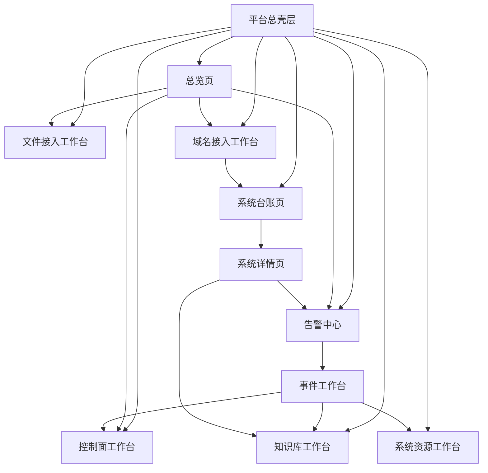
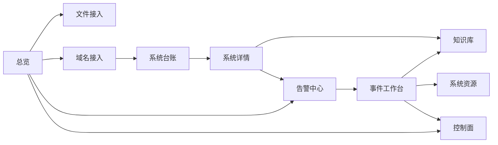

# 统一运维平台全量原型与交互草案（2026-03-20）

> 文档状态：现行全量原型草案  
> 适用范围：统一控制台、全平台页面结构、主要工作台、详情页、抽屉与跨页交互  
> 对齐口径：以主线平台定位、总体架构、模块边界、阶段路线与多环境纳管方案为准  
> 阅读前置：建议先读  
> 1. `docs/02-架构设计/统一运维平台架构草图-2026-03-20.md`  
> 2. `docs/02-架构设计/统一运维平台低保真原型-2026-03-20.md`

## 1. 本文目标

前两份文档已经回答了：

- 平台整体长什么样
- 第一批页面低保真怎么排

但如果要“一口气做完”原型讨论，还需要补齐下面这些内容：

1. 平台到底有哪些页面，页面之间怎么跳转
2. 每张页面该放哪些区块、字段、操作
3. 列表页、工作台页、详情页、抽屉页各自承担什么职责
4. 当前已有能力与后续纳管能力，怎么统一到一套平台信息架构里

因此，本文的目标是把平台页面、页面结构、核心字段、主要交互、跨页关系一次性铺全。

## 2. 范围与边界

### 2.1 本文覆盖

本草案覆盖以下页面：

1. 平台总壳层
2. 总览页
3. 告警中心
4. 事件工作台
5. 文件接入工作台
6. 域名接入工作台
7. 系统台账页
8. 系统详情页
9. 知识库工作台
10. 控制面工作台
11. 系统资源工作台

### 2.2 本文不做

当前不展开以下内容：

- 多租户 / RBAC / 组织维度后台
- 发布编排系统
- 审批流设计
- 复杂 CMDB 关系建模 UI
- 完整配置中心推拉台

原因：这些内容不符合当前阶段范围边界。

## 3. 平台页面总图



### 核心原则

1. 平台只有一个壳层，不允许各页面自己发明导航体系。
2. “中心页”和“工作台页”分开：
   - 告警中心：批量看和筛
   - 事件工作台：深度处置单事件
3. “接入页”和“沉淀页”分开：
   - 域名接入：自动探测和草案生成
   - 系统台账：沉淀系统事实

## 4. 平台总壳层

### 4.1 页面职责

平台总壳层负责：

1. 一级导航
2. 全局搜索
3. 环境和时间范围筛选
4. 当前值班上下文
5. 通知与待办提醒

### 4.2 中保真框图

```text
┌─────────────────────────────────────────────────────────────────────────────────────────────────────────────┐
│ GWF                                                                                                        │
│ 总览 | 告警中心 | 文件接入 | 域名接入 | 系统台账 | 知识库 | 控制面 | 系统资源                             │
│-------------------------------------------------------------------------------------------------------------│
│ 全局搜索：事件 / 系统 / 域名 / 条目 / Agent                                                                │
│ 环境：全部 / prod / test / temp      时间范围：实时 / 24h / 7d      当前值班人      通知      待办       │
├─────────────────────────────────────────────────────────────────────────────────────────────────────────────┤
│ 页面标题 + 当前页面说明                                                                                     │
│ 页面内 Tab / 筛选条 / 二级导航                                                                              │
├─────────────────────────────────────────────────────────────────────────────────────────────────────────────┤
│ 页面内容区                                                                                                  │
└─────────────────────────────────────────────────────────────────────────────────────────────────────────────┘
```

### 4.3 一级导航说明

| 一级导航 | 类型 | 作用 |
| --- | --- | --- |
| 总览 | 值班入口 | 看全局状态与待办 |
| 告警中心 | 中心页 | 批量看告警与筛选 |
| 文件接入 | 工作台 | 处理文件入云链路 |
| 域名接入 | 工作台 | 生成接入草案 |
| 系统台账 | 中心页 | 看系统、环境、服务台账 |
| 知识库 | 工作台 | 编辑、审核、问答、回滚 |
| 控制面 | 工作台 | Agent / Task / 审计 |
| 系统资源 | 工作台 | 主机与进程观察 |

### 4.4 不再使用什么

不建议继续使用：

- 全站大面积左侧常驻侧栏
- 把所有层级都塞进左边
- 每个页面再自带一套完全不同的导航壳

## 5. 总览页

### 5.1 页面职责

这页是“值班首页”，重点是：

- 一眼看到当前风险
- 一眼看到关键链路
- 一眼知道先做什么

### 5.2 中保真框图

```text
┌──────────────────────────────────────────────────────────────────────────────────────────────┐
│ 页面标题：平台总览                                                                          │
│ 说明：统一查看当前运维事件闭环、接入状态与待处理事项                                        │
├──────────────────────────────────────────────────────────────────────────────────────────────┤
│ 状态条：在线系统 | 未恢复告警 | 待处理事件 | 上传失败率 | AI 降级率 | backlog               │
├───────────────────────────────────────────────┬──────────────────────────────────────────────┤
│ 告警趋势 / 事件时间线                           │ 系统健康分布 / 环境分布                      │
│ [告警曲线]                                      │ [健康分层图]                                 │
│ [最近事件时间线]                                │ [prod/test/temp 占比]                        │
├───────────────────────────────────────────────┼──────────────────────────────────────────────┤
│ 当前待办事项                                   │ 最近变更 / 最近回放 / 最近失败原因           │
│ - 高等级告警待确认                              │ - 最近配置变更                               │
│ - 接入待确认事项                                │ - 最近 AI / 上传回放                         │
│ - 健康探测异常                                  │ - TopN 失败原因                              │
└───────────────────────────────────────────────┴──────────────────────────────────────────────┘
```

### 5.3 核心字段

- 在线系统数
- 未恢复告警数
- 待处理事件数
- 上传失败率
- AI 降级率
- 控制面 backlog
- 最近变更
- 最近失败原因

### 5.4 点击路径

- 点“未恢复告警数” -> 进入告警中心并带上 `status=open`
- 点“接入待确认事项” -> 进入域名接入页或系统台账待确认过滤
- 点“最近失败原因” -> 进入控制面或文件接入工作台

## 6. 告警中心

### 6.1 页面职责

这页是“批量告警处理页”，不是单事件页。

主要回答：

1. 当前有哪些告警
2. 哪些告警最紧急
3. 怎样快速筛选并进入事件处置

### 6.2 中保真框图

```text
┌──────────────────────────────────────────────────────────────────────────────────────────────┐
│ 页面标题：告警中心                                                                          │
│ 说明：统一查看风险概览、告警列表、决策状态与规则配置                                        │
├──────────────────────────────────────────────────────────────────────────────────────────────┤
│ 筛选条：级别 | 状态 | 服务 | 规则 | 时间范围 | 是否已通知 | 是否已关联知识                 │
├──────────────────────────────────────────────────────────────────────────────────────────────┤
│ 风险摘要：Fatal / System / Business / Sent / Suppressed / Latest                           │
├───────────────────────────────────────────────────────────────┬──────────────────────────────┤
│ 告警列表                                                       │ 选中详情抽屉 / 右侧面板      │
│ 时间 | 级别 | 服务 | 规则 | 状态 | 最新说明                    │ - 告警摘要                   │
│                                                                │ - 决策解释                   │
│                                                                │ - AI 结论                    │
│                                                                │ - 知识推荐                   │
│                                                                │ - 跳转事件工作台             │
└───────────────────────────────────────────────────────────────┴──────────────────────────────┘
```

### 6.3 关键交互

1. 选中一条告警，右侧展开详情。
2. 点击“进入事件工作台”，跳转到单事件处置页。
3. 点击“知识推荐”，展开知识引用和 trace。
4. 点击“规则”，跳转或切换到规则配置面板。

### 6.4 当前接口映射

- `/api/alerts`
- `/api/alert-config`
- `/api/alert-rules`
- `/api/kb/recommendations`

## 7. 事件工作台

### 7.1 页面职责

这页是“单事件深度处置空间”，重点不在“看列表”，而在：

- 看时间线
- 看 AI 诊断
- 看知识 SOP
- 发控制面任务
- 写审计与处置结果

### 7.2 中保真框图

```text
┌──────────────────────────────────────────────────────────────────────────────────────────────┐
│ 事件标题 | 等级 | 当前状态 | 责任人 | SLA / 已持续时间                                         │
├───────────────────────────────┬───────────────────────────────┬──────────────────────────────┤
│ 事件时间线                     │ AI 诊断 / 日志摘要            │ 处置动作 / 知识 SOP         │
│ - 创建                         │ - 概要                        │ - 指派责任人                │
│ - 升级                         │ - 根因推测                    │ - 触发控制面任务            │
│ - 已通知                       │ - 关键错误                    │ - 回滚建议                  │
│ - 已处理                       │ - 建议动作                    │ - 查看 SOP                  │
├───────────────────────────────┴───────────────────────────────┼──────────────────────────────┤
│ 审计记录 / 评论 / 交接记录                                      │ 关联资源 / 主机 / 系统       │
└────────────────────────────────────────────────────────────────┴──────────────────────────────┘
```

### 7.3 关键交互

- 从告警中心进入
- 从系统详情页的最近事件进入
- 触发控制面任务后，右侧可直接看到任务状态链接
- AI / 知识 / 审计三者必须在同一页聚合

### 7.4 当前能力映射

这页当前在代码里还没有完整落成，但它是你平台主线闭环最重要的一张目标页。

它会承接：

- 告警模块
- AI 分析
- 知识推荐
- 控制面任务
- 审计日志

## 8. 文件接入工作台

### 8.1 页面职责

围绕文件入云主线，提供：

- 监控范围查看
- 文件状态和上传队列
- 日志分析
- AI 辅助
- 趋势与失败分布

### 8.2 中保真框图

```text
┌──────────────────────────────────────────────────────────────────────────────────────────────┐
│ 页面标题：文件接入工作台                                                                     │
│ 说明：围绕监控、入队、上传、失败解释与日志分析展开                                           │
├──────────────────────────────────────────────────────────────────────────────────────────────┤
│ 状态条：监控目录数 | 队列长度 | inFlight | failure ratio | retry total | 最近上传            │
├───────────────────────────────┬───────────────────────────────┬──────────────────────────────┤
│ 目录与监控范围                 │ 文件列表 / 上传队列            │ 文件日志 + AI 分析            │
│ - 目录切换                     │ - 文件名                       │ - Tail / Search               │
│ - 自动上传开关                 │ - 状态                         │ - AI 摘要                     │
│ - 当前选中文件                 │ - 大小 / 时间                  │ - 关键错误                    │
│                               │ - 查看 / 下载 / 立即上传        │ - 建议动作                    │
├───────────────────────────────┴───────────────────────────────┼──────────────────────────────┤
│ 上传趋势 / 队列变化 / 失败原因分布                               │ 最近上传记录                  │
└───────────────────────────────────────────────────────────────┴──────────────────────────────┘
```

### 8.3 页面字段

#### 状态条

- 监控目录数
- 队列长度
- inFlight
- 失败率
- retry total
- 最近上传时间

#### 左区

- 根目录切换
- 自动上传开关
- 当前文件信息

#### 中区

- 文件名
- 路径
- 状态
- 自动上传状态
- 更新时间

#### 右区

- Tail / Search 模式
- AI 摘要
- 关键错误
- 可能原因
- 建议动作

### 8.4 当前接口映射

- `/api/dashboard`
- `/api/manual-upload`
- `/api/auto-upload`
- `/api/config`
- `/api/file-log`
- `/api/ai/log-summary`
- `/api/health`
- `/metrics`

## 9. 域名接入工作台

### 9.1 页面职责

这是“系统纳管的入口页”，作用是：

- 自动识别域名入口信息
- 生成接入草案
- 输出待确认事项
- 为后续生成系统台账草稿做准备

### 9.2 中保真框图

```text
┌──────────────────────────────────────────────────────────────────────────────────────────────┐
│ 页面标题：域名接入工作台                                                                     │
│ 说明：输入域名，自动探测入口状态并生成接入草案                                               │
├──────────────────────────────────────────────────────────────────────────────────────────────┤
│ 输入域名 + 开始探测 + 使用示例 + 导出 JSON                                                    │
├──────────────────────────────────────────────────────────────────────────────────────────────┤
│ 接入摘要：建议接入类型 | 建议入口 | TLS 状态 | 候选健康接口数 | 待确认事项数                │
├───────────────────────────────┬───────────────────────────────┬──────────────────────────────┤
│ DNS                           │ HTTP / HTTPS 根路径            │ TLS                         │
│ - host / cname / ip           │ - status / final url           │ - 证书主题 / 颁发者         │
│ - 公网可达                    │ - 页面类型 / API 提示          │ - 有效期 / SAN 匹配         │
│                               │ - 跳转链路                     │                              │
├───────────────────────────────┴───────────────────────────────┼──────────────────────────────┤
│ 候选健康接口                                                   │ 待确认事项                   │
│ - /health                                                      │ - 环境归属                   │
│ - /actuator/health                                             │ - 负责人                     │
│ - /api/health                                                  │ - 部署方式                   │
│ - /api/actuator/health                                         │ - 正式健康接口               │
├──────────────────────────────────────────────────────────────────────────────────────────────┤
│ 原始探测结果 JSON                                                                       │
└──────────────────────────────────────────────────────────────────────────────────────────────┘
```

### 9.3 页面字段

#### 接入摘要

- `suggestedAccessType`
- `recommendedBaseUrl`
- `tls.status`
- `healthCandidates.length`
- `pendingItems.length`

#### DNS

- host
- cname
- addresses
- publiclyRoutable

#### HTTP / HTTPS

- url / finalUrl
- reachable / statusCode
- contentType / contentKind / pageKind
- API hint
- redirect chain

#### TLS

- status
- subjectCommonName
- issuerCommonName
- notBefore / notAfter
- daysRemaining
- serverNameMatched

#### 待确认事项

- 环境归属
- 负责人
- 部署方式
- 正式健康接口
- 证书告警纳入

### 9.4 当前接口映射

- `/api/registry/domain-probe`

### 9.5 后续承接页面

- 一键生成系统台账草稿
- 跳转系统台账页
- 生成 Route / Health Rule / Config Set 初稿

## 10. 系统台账页

### 10.1 页面职责

这页承接“纳管完成后的系统事实”，目标不是探测，而是沉淀：

- 系统
- 环境
- 服务
- 路由
- 健康规则
- 配置完整度

### 10.2 中保真框图

```text
┌──────────────────────────────────────────────────────────────────────────────────────────────┐
│ 页面标题：系统台账                                                                          │
│ 说明：统一查看当前纳管系统、环境、服务、入口、健康规则与配置完整度                          │
├──────────────────────────────────────────────────────────────────────────────────────────────┤
│ 筛选条：系统名 | 环境 | 负责人 | 健康状态 | 接入完成度 | 来源类型                             │
├──────────────────────────────────────────────────────────────────────────────────────────────┤
│ 系统列表                                                                                   │
│ 系统名 | 环境数 | 服务数 | 入口域名数 | 健康状态 | 配置完整度 | 负责人 | 最近更新时间          │
├──────────────────────────────────────────────────────────────────────────────────────────────┤
│ 点开某一行 -> 右侧详情抽屉 / 跳转系统详情页                                                  │
└──────────────────────────────────────────────────────────────────────────────────────────────┘
```

### 10.3 建议字段

- 系统名
- 系统 key
- owner
- importance
- env count
- service count
- route count
- 健康状态
- 配置完整度
- 最近更新时间

### 10.4 数据来源

当前阶段建议来自：

- 台账 YAML / Git 事实源
- 域名接入草稿
- 后续主机巡检 / Agent 结果

## 11. 系统详情页

### 11.1 页面职责

这页是“单系统运维视图”，回答：

1. 这套系统由哪些服务组成
2. 各环境是什么状态
3. 域名和健康规则是什么
4. 配置完整度怎样
5. 最近发生了什么

### 11.2 中保真框图

```text
┌──────────────────────────────────────────────────────────────────────────────────────────────┐
│ 系统标题 + 环境切换（prod / test / temp） + 健康状态 + 责任人                               │
├───────────────────────────────┬───────────────────────────────┬──────────────────────────────┤
│ 服务拓扑 / 服务列表             │ 入口与路由                    │ 健康规则                     │
│ - frontend                     │ - domain                      │ - check type                 │
│ - backend-api                  │ - path_prefix                 │ - target                     │
│ - worker                       │ - target_ref                  │ - interval / timeout         │
├───────────────────────────────┼───────────────────────────────┼──────────────────────────────┤
│ 配置完整度 / 敏感项来源         │ 知识 / SOP / 回滚说明         │ 最近事件 / 最近告警          │
└───────────────────────────────┴───────────────────────────────┴──────────────────────────────┘
```

### 11.3 关键交互

- 环境切换：`prod/test/temp`
- 点击服务 -> 打开服务详情抽屉
- 点击最近事件 -> 进入事件工作台
- 点击 SOP -> 进入知识库对应条目

## 12. 知识库工作台

### 12.1 页面职责

提供：

- 条目浏览
- 编辑与审核
- 导入与回滚
- 问答

### 12.2 中保真框图

```text
┌──────────────────────────────────────────────────────────────────────────────────────────────┐
│ 页面标题：知识库工作台                                                                       │
│ 说明：围绕事故沉淀、审核、问答引用和回滚展开                                                 │
├──────────────────────────────────────────────────────────────────────────────────────────────┤
│ 搜索 / 状态 / 严重级别 / 导入 docs / RAG 检索                                                │
├───────────────────────────────────────────────┬──────────────────────────────────────────────┤
│ 条目列表 / 待审核队列                           │ 编辑区 / 预览 / 差异 / 版本 / 回滚            │
├───────────────────────────────────────────────┴──────────────────────────────────────────────┤
│ 知识问答区：问题输入 -> 回答 -> 引用来源                                                │
└──────────────────────────────────────────────────────────────────────────────────────────────┘
```

### 12.3 当前接口映射

- `/api/kb/articles*`
- `/api/kb/search`
- `/api/kb/ask`
- `/api/kb/import/docs`
- `/api/kb/reviews/pending`
- `/api/kb/gates`

## 13. 控制面工作台

### 13.1 页面职责

控制面页不是“系统看板”，而是“任务调度与执行页”。

要回答：

1. Agent 是否在线
2. 任务当前积压多少
3. 失败主要因为什么
4. 单任务事件流是什么
5. 审计记录是否完整

### 13.2 中保真框图

```text
┌──────────────────────────────────────────────────────────────────────────────────────────────┐
│ 页面标题：控制面工作台                                                                       │
│ 说明：统一查看 Agent、任务、事件流、失败原因与审计                                           │
├──────────────────────────────────────────────────────────────────────────────────────────────┤
│ 状态条：在线 Agent | backlog | running | failed | timeout                                   │
├───────────────────────────────┬──────────────────────────────────────────────────────────────┤
│ Agent 列表                     │ 任务列表                                                 │
│ - agentKey                     │ - type / target / status / retry / time                  │
│ - status                       │ - cancel / retry                                         │
│ - group                        │                                                          │
├───────────────────────────────┴──────────────────────────────────────────────────────────────┤
│ 失败原因分布 / 任务事件流 / 审计日志                                                        │
└──────────────────────────────────────────────────────────────────────────────────────────────┘
```

### 13.3 当前接口映射

- `/api/control/agents`
- `/api/control/tasks`
- `/api/control/tasks/{id}/events`
- `/api/control/tasks/failure-reasons`
- `/api/control/audit`

## 14. 系统资源工作台

### 14.1 页面职责

系统资源页是“主机观察与轻量处置”页。

主要内容：

- 系统概览
- CPU / 内存 / 磁盘
- 进程列表
- 进程详情
- 一键终止

### 14.2 中保真框图

```text
┌──────────────────────────────────────────────────────────────────────────────────────────────┐
│ 页面标题：系统资源工作台                                                                     │
│ 说明：统一查看主机状态、进程占用与轻量处置                                                   │
├──────────────────────────────────────────────────────────────────────────────────────────────┤
│ 主机摘要：host | ip | load | uptime | 连接数                                                 │
├───────────────────────────────────────────────┬──────────────────────────────────────────────┤
│ CPU / 内存 / 磁盘卡片                          │ 分区视图                                      │
├───────────────────────────────────────────────┴──────────────────────────────────────────────┤
│ 进程列表：筛选 / 排序 / 端口过滤                                                       │
├──────────────────────────────────────────────────────────────────────────────────────────────┤
│ 进程详情：命令 / 路径 / 环境变量 / 终止动作                                            │
└──────────────────────────────────────────────────────────────────────────────────────────────┘
```

### 14.3 当前接口映射

- `/api/system`
- `/api/system/terminate`

## 15. 关键跨页交互图



## 16. 页面类型与推荐布局

| 页面 | 页面类型 | 推荐布局 |
| --- | --- | --- |
| 总览 | 概览页 | 状态条 + 双列图表 + 待办 |
| 告警中心 | 列表中心页 | 筛选条 + 列表 + 右侧详情 |
| 事件工作台 | 深度工作台 | 时间线 + AI + 处置动作三栏 |
| 文件接入 | 工作台 | 左中右主区 + 底部趋势 |
| 域名接入 | 工作台 | 输入区 + 结果区 + JSON |
| 系统台账 | 列表中心页 | 筛选 + 台账列表 |
| 系统详情 | 详情页 | 三列信息块 |
| 知识库 | 工作台 | 列表 + 编辑 + 问答 |
| 控制面 | 工作台 | Agent / Task 上下分区 |
| 系统资源 | 工作台 | 概览 + 进程双层布局 |

## 17. 全量原型和当前规划的一致性说明

这份全量原型草案严格符合以下边界：

1. 主线仍然是运维事件闭环，不是“大而全运维平台”
2. 域名接入和系统纳管是统一控制台扩展，而不是第二套系统
3. 控制面、系统资源、通知是支撑能力，不替代主线叙事
4. 当前阶段不提前引入复杂多租户、RBAC、编排、配置中心页面

因此，这份文档可以直接作为下一步中保真 / 高保真 UI 原型设计的统一基线。

## 18. 建议的下一步

如果继续推进，建议按下面顺序：

1. 基于本文先确认页面结构，不先纠结颜色
2. 先做 4 张高优先级页面中保真 / 高保真
   - 平台总壳层
   - 总览页
   - 文件接入工作台
   - 域名接入工作台
3. 再补告警中心、事件工作台、系统台账、系统详情
4. 最后统一知识库、控制面、系统资源的视觉语言
