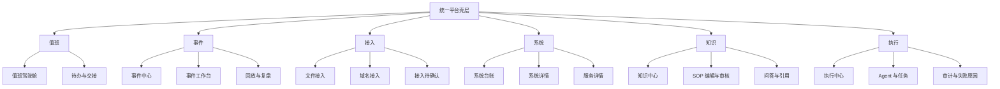

# 统一运维平台完整产品与页面设计（2026-04-17）

> 文档状态：建议稿（完整设计）  
> 适用范围：GWF 统一控制台的产品形态、页面体系、核心功能、关键流程与数据主线设计  
> 设计基线：建立在 `docs/02-架构设计/统一运维平台重设计方案-2026-04-17.md` 之上  
> 冲突处理：如与 2026-03-20 原型文档冲突，以本文作为新的重设计方向

## 1. 设计结论

GWF 不应该继续设计成“文件控制台 + 告警控制台 + 知识库控制台 + 控制面控制台”的模块拼盘。

新的产品形态应该改成：

`一个面向值班和事件闭环的统一运维工作台`

也就是：

- 首页不是模块导航页，而是值班驾驶舱。
- 告警页不是规则展示页，而是事件分诊页。
- 事件页不是详情补充页，而是唯一的处置工作台。
- 域名接入、文件接入、系统台账都不是孤立页面，而是“接入 -> 纳管 -> 事件 -> 复盘”主线的一部分。
- 控制面和系统资源不再作为并列主舞台，而是挂靠到事件处置和系统详情里。

这次完整设计要解决的，不是“页面漂不漂亮”，而是下面四个问题：

1. 值班工程师进来之后先看什么、先做什么。
2. 一个事件从发现到处置到复盘，是否能在同一条主线上完成。
3. 一个系统从域名接入到纳管再到持续运维，是否能在同一套控制台中完成。
4. 页面和功能是否真正围绕运维工作流，而不是围绕后端接口分类。

## 2. 为什么当前页面和功能不满足需求

## 2.1 当前页面的核心问题

当前页面的主要问题不是“功能少”，而是“组织方式不对”。

### 问题 1：导航按技术模块切，而不是按工作场景切

现在的页面更像：

- 文件
- 告警
- 知识
- 控制
- 系统
- 域名

这更像开发视角，而不是值班视角。

值班工程师真正关心的是：

- 现在有没有高风险事件
- 哪个系统出问题了
- 该看哪些证据
- 该执行什么动作
- 这次问题有没有 SOP
- 问题处理完之后如何沉淀

### 问题 2：事件闭环被拆散在多个页面

当前一个事件的关键动作被拆到了多个地方：

- 告警在告警页
- AI 分析在日志分析或告警详情里
- 知识推荐在另一个链路里
- 控制面任务在控制面页
- 审计又在另一个区域

这会带来一个直接体验问题：

用户明明是在处理“同一个故障”，却必须在多个页面之间来回跳。

### 问题 3：页面大多偏“看”，不够偏“决策和执行”

当前很多页面具备展示能力，但仍缺少真正服务决策的结构，例如：

- 没有真正的值班待办视图
- 没有单事件工作台作为统一操作上下文
- 没有系统视角下的“最近事件 / 入口 / 健康 / SOP / 责任人”统一视图
- 没有把“接入动作”设计成一条从输入域名到生成台账草稿的工作流

### 问题 4：页面数量已经很多，但用户任务仍没有被压缩

页面多不等于产品完整。

如果一个值班工程师仍然需要自己脑补“从哪里开始、接下来跳哪里、下一步谁来做”，说明产品还没有真正替他组织工作流。

## 2.2 当前功能的核心问题

从功能角度看，现在的问题不是“没有功能”，而是“功能之间缺少主次和收口”。

### 当前已有但没有被正确组织的能力

- 文件监听、入队、上传、失败重试
- 告警规则、抑制、升级、通知
- AI 摘要与降级
- 知识库编辑、检索、问答、推荐
- 域名探测原型
- 控制面 Agent / Task / 审计
- 系统资源采集与终止

### 这些能力当前缺的不是更多按钮，而是统一工作流

所以新设计的目标不是继续加更多页面，而是把这些能力重排成下面三条主线：

1. 值班主线：发现 -> 分诊 -> 处置 -> 交接
2. 纳管主线：接入 -> 确认 -> 沉淀 -> 健康治理
3. 沉淀主线：事件 -> SOP -> 回放 -> 知识复用

## 3. 新的产品定位

新的 GWF 应该这样定义：

> 一个面向运维工程师 / SRE / 平台维护者的事件驱动型运维工作台。  
> 它以“值班、事件、系统、接入、知识、执行”六个工作域组织能力，统一承载发现、诊断、处置、纳管、复盘与追溯。

这一定义和原来的主线并不冲突，而是把原来的主线变成“用户真正能感受到的产品形态”。

## 4. 目标用户与高频场景

## 4.1 用户分层

### 用户 1：值班工程师

关心：

- 当前是否有高风险事件
- 事件是否已有人处理
- 有无 SOP
- 是否需要触发任务或升级

### 用户 2：SRE

关心：

- 风险是否集中在某些系统 / 某类环境
- 告警策略是否误报漏报
- AI 降级是否可控
- 复盘材料是否足够完整

### 用户 3：平台维护者

关心：

- 系统纳管是否完整
- 接入是否标准化
- 控制面和任务执行是否稳定
- 配置、健康、责任边界是否清楚

## 4.2 6 个高频场景

### 场景 1：值班开始

我要在 1 分钟内知道：

- 当前风险有没有爆
- 哪些事情还没人处理
- 哪些系统不健康

### 场景 2：高等级故障出现

我要在一个工作台里完成：

- 看告警
- 看 AI
- 看日志证据
- 看 SOP
- 派任务
- 写处置记录

### 场景 3：从域名开始纳管一套系统

我要输入一个域名，然后系统告诉我：

- 这是什么入口
- 当前是否可用
- 候选健康接口是什么
- 我还缺什么信息

### 场景 4：查看某个系统整体状态

我要看到：

- 这个系统有哪些环境
- 域名和服务分别是什么
- 健康情况如何
- 最近发生了什么事件
- SOP 和回滚路径是什么

### 场景 5：把一次事故沉淀成知识

我要把这次事件里的：

- 根因
- 关键日志
- 处置步骤
- 防复发建议

沉淀成可以复用的 SOP。

### 场景 6：执行与追踪

我要知道：

- 任务有没有被执行
- 谁执行了什么
- 失败原因是什么
- 这次动作是否影响了事件状态

## 5. 新的产品信息架构

## 5.1 一级导航重做

新的一级导航不再按技术模块，而按工作域组织：

1. 值班
2. 事件
3. 接入
4. 系统
5. 知识
6. 执行

这 6 个一级导航就够了。

不再建议把下面这些都做成一级导航：

- 文件接入
- 告警中心
- 系统资源
- 域名接入
- 控制面

这些能力仍然存在，但应该收进更符合任务心智的页面体系中。

## 5.2 信息架构图



## 6. 新页面体系

## 6.1 值班：值班驾驶舱

### 页面职责

值班页不是总览卡片墙，而是“当班工作入口”。

它要回答：

- 现在最危险的是什么
- 先处理哪几件事
- 有没有接近 SLA 的事件
- 需要交接什么

### 页面结构

```text
┌──────────────────────────────────────────────────────────────────────────────┐
│ 页面标题：值班驾驶舱                                                         │
│ 说明：当前风险、待办、交接与主线健康概况                                      │
├──────────────────────────────────────────────────────────────────────────────┤
│ 风险条：P1事件 | 未恢复告警 | AI降级 | 上传异常 | 接入待确认 | 执行积压       │
├───────────────────────────────┬──────────────────────────────────────────────┤
│ 当前待办                        │ 事件时间线 / 交接动态                        │
├───────────────────────────────┼──────────────────────────────────────────────┤
│ 主线健康概况                    │ 最近失败原因 / 最近高频系统                  │
└───────────────────────────────┴──────────────────────────────────────────────┘
```

### 核心功能

- 风险排序
- 待办分组
- SLA 即将超时提醒
- 当班交接记录
- 一键进入事件工作台

### 必须可点开的对象

- 事件
- 系统
- 接入待确认项
- 执行失败原因

## 6.2 事件：事件中心

### 页面职责

事件中心是批量分诊和筛选入口。

这页不处理深度诊断，只负责：

- 看事件队列
- 分风险
- 分配责任
- 进入工作台

### 页面结构

```text
┌──────────────────────────────────────────────────────────────────────────────┐
│ 页面标题：事件中心                                                           │
│ 筛选：等级 | 状态 | 服务 | 系统 | 来源 | 是否有知识 | 是否已派任务          │
├──────────────────────────────────────────────────────────────────────────────┤
│ 摘要条：新建 | 处理中 | 已升级 | 已恢复 | 近1h新增 | 近1h误报                │
├───────────────────────────────────────────────┬──────────────────────────────┤
│ 事件列表                                       │ 右侧快速详情                  │
│ 时间 | 标题 | 系统 | 等级 | 状态 | owner      │ - AI摘要                      │
│                                               │ - 关键证据                    │
│                                               │ - 推荐SOP                     │
│                                               │ - 快速派单                    │
│                                               │ - 进入工作台                  │
└───────────────────────────────────────────────┴──────────────────────────────┘
```

### 核心功能

- 事件聚类
- 按系统 / 服务 / 环境筛选
- 批量认领
- 快速派单
- 快速查看 AI / 知识摘要

### 当前能力映射

- 告警决策
- AI 分析
- 知识推荐
- 控制任务创建入口

## 6.3 事件：事件工作台

### 页面职责

这是整个产品最核心的页面。

一条事件在这里完成：

- 证据汇总
- AI 诊断
- SOP 对照
- 任务执行
- 审计记录
- 恢复判断

### 页面结构

```text
┌──────────────────────────────────────────────────────────────────────────────┐
│ 事件标题 | 等级 | 状态 | owner | 已持续时间 | 影响范围                         │
├───────────────────────────────┬───────────────────────────────┬──────────────┤
│ 时间线                         │ 诊断面板                       │ 动作面板       │
│ - 事件创建                     │ - AI摘要                       │ - 指派         │
│ - 告警升级                     │ - 关键日志                     │ - 派任务       │
│ - 已通知                       │ - 根因推测                     │ - 标记恢复     │
│ - 任务执行                     │ - 关联系统/服务                │ - 添加记录     │
├───────────────────────────────┴───────────────────────────────┼──────────────┤
│ SOP / 知识 / 回放                                                   │ 审计 / 评论 │
└────────────────────────────────────────────────────────────────────┴──────────────┘
```

### 核心功能

- 单事件时间线
- AI 分析落地展示
- 知识推荐与 SOP 直接展开
- 创建控制任务
- 查看任务回执
- 写处置记录
- 标记事件恢复
- 生成复盘草稿

### 这页必须成为唯一深度处置页

否则系统永远会停留在“很多控制台，但没有真正的工作台”。

## 6.4 接入：接入中心

接入中心不是一页，而是一个工作域，包含 3 个二级页签：

1. 文件接入
2. 域名接入
3. 接入待确认

### 6.4.1 文件接入

#### 页面职责

围绕“文件入云稳定性”组织工作，而不是围绕目录树组织。

#### 页面结构

```text
┌──────────────────────────────────────────────────────────────────────────────┐
│ 状态条：监控目录 | queue | inFlight | failure ratio | retry | 最近上传        │
├───────────────────────────────┬───────────────────────────────┬──────────────┤
│ 接入范围 / 目录                │ 文件与上传队列                 │ 日志与AI       │
├───────────────────────────────┴───────────────────────────────┼──────────────┤
│ 趋势 / 失败原因 / 最近上传                                           │ 运行健康     │
└────────────────────────────────────────────────────────────────────┴──────────────┘
```

#### 核心功能

- 监控范围管理
- 手动上传
- 文件日志 Tail / Search
- AI 摘要
- 队列和失败原因观察

### 6.4.2 域名接入

#### 页面职责

输入域名后自动生成接入草案，并告诉用户下一步缺什么。

#### 页面结构

```text
┌──────────────────────────────────────────────────────────────────────────────┐
│ 输入域名 + 开始探测 + 导出 JSON                                             │
├──────────────────────────────────────────────────────────────────────────────┤
│ 接入结论：建议接入类型 | 推荐入口 | TLS状态 | 健康候选数 | 待确认数          │
├───────────────────────────────┬───────────────────────────────┬──────────────┤
│ DNS / HTTP / HTTPS / TLS       │ 候选健康接口                  │ 待确认事项     │
├──────────────────────────────────────────────────────────────────────────────┤
│ 原始结果 JSON                                                             │
└──────────────────────────────────────────────────────────────────────────────┘
```

#### 核心功能

- 域名探测
- TLS 检查
- 健康接口候选
- 接入草案
- 一键生成系统草稿

### 6.4.3 接入待确认

#### 页面职责

集中处理“系统已经半接入，但还有人工确认项”的工作。

#### 核心功能

- 按负责人筛选
- 按环境类型筛选
- 批量确认
- 一键转台账

## 6.5 系统：系统中心

系统中心包含 2 层：

1. 系统台账列表
2. 系统详情

### 6.5.1 系统台账列表

#### 页面职责

这是平台的“纳管事实面”。

#### 页面结构

```text
┌──────────────────────────────────────────────────────────────────────────────┐
│ 筛选：系统 | 环境 | owner | 健康状态 | 接入完成度                           │
├──────────────────────────────────────────────────────────────────────────────┤
│ 系统列表：系统名 | 环境数 | 服务数 | 域名数 | 健康状态 | 配置完整度 | 更新时间 │
└──────────────────────────────────────────────────────────────────────────────┘
```

#### 核心功能

- 系统查询
- 环境分布查看
- 健康状态查看
- 配置完整度查看
- 进入系统详情

### 6.5.2 系统详情

#### 页面职责

系统详情是“单系统运维总视图”。

它要把下面这些信息放到同一页：

- 环境
- 服务
- 入口
- 健康规则
- 最近事件
- 知识 / SOP
- 责任人

#### 页面结构

```text
┌──────────────────────────────────────────────────────────────────────────────┐
│ 系统标题 | 环境切换 | 健康状态 | owner | 最近变更                             │
├───────────────────────────────┬───────────────────────────────┬──────────────┤
│ 服务与部署                     │ 入口与路由                    │ 健康规则       │
├───────────────────────────────┼───────────────────────────────┼──────────────┤
│ 配置完整度                     │ 最近事件                      │ SOP / 回滚说明 │
└───────────────────────────────┴───────────────────────────────┴──────────────┘
```

#### 核心功能

- 环境切换
- 服务详情抽屉
- 查看最近事件
- 查看知识和 SOP
- 跳转事件工作台
- 跳转执行中心

## 6.6 知识：知识中心

知识中心包含 3 条线：

1. 条目浏览与筛选
2. 编辑与审核
3. 问答与引用

### 页面职责

这页不是“文档页”，而是“事故沉淀工作台”。

### 页面结构

```text
┌──────────────────────────────────────────────────────────────────────────────┐
│ 搜索 / 状态 / 严重级别 / 服务 / 环境 / 导入 docs                            │
├───────────────────────────────┬───────────────────────────────┬──────────────┤
│ 条目列表 / 待审核               │ 编辑 / 预览 / 差异            │ 问答与引用     │
└───────────────────────────────┴───────────────────────────────┴──────────────┘
```

### 核心功能

- 条目生命周期
- 版本与回滚
- 文档导入
- 引用式问答
- 从事件生成 SOP 草稿

## 6.7 执行：执行中心

执行中心把原来的控制面和系统资源重组到同一个工作域里。

执行中心不再只展示“任务”，而是围绕“动作执行与结果追踪”。

### 二级页签建议

1. 任务与 Agent
2. 审计与失败原因
3. 资源与进程

### 6.7.1 任务与 Agent

#### 核心功能

- Agent 在线状态
- backlog
- running / failed / timeout
- cancel / retry
- 任务事件流

### 6.7.2 审计与失败原因

#### 核心功能

- 失败原因 TopN
- 审计日志查询
- 事件/任务回链

### 6.7.3 资源与进程

#### 页面定位

系统资源不再单独做一级导航，而是作为执行和排障的支撑面。

#### 核心功能

- 主机概览
- 进程列表
- 进程详情
- 终止动作

## 7. 功能蓝图

## 7.1 本阶段必须具备的核心功能

### 值班

- 风险总览
- 待办列表
- 交接摘要

### 事件

- 事件聚类
- 单事件工作台
- AI 诊断
- SOP 推荐
- 任务联动
- 审计记录

### 接入

- 文件接入稳定性
- 域名探测
- 接入待确认

### 系统

- 系统台账
- 系统详情
- 健康与入口事实

### 知识

- 条目生命周期
- 检索 / 问答 / 推荐
- 回滚

### 执行

- Agent / Task
- 审计与失败原因
- 资源与进程

## 7.2 下一阶段增强功能

- 事件自动聚类质量提升
- 系统台账与域名接入草稿自动互转
- 任务模板化
- 事件到复盘模板的一键生成
- 更强的系统健康规则编排

## 7.3 当前明确不做

- 多租户后台
- 完整 RBAC
- 重型 CMDB
- 复杂发布编排系统
- 大而全配置中心 UI

## 8. 关键用户流程

## 8.1 值班开始流程

```text
登录 -> 值班驾驶舱 -> 看风险条 -> 打开待办 -> 进入事件工作台
```

## 8.2 高优先级事件处置流程

```text
事件中心 -> 选中事件 -> 进入事件工作台
-> 看时间线与AI
-> 看日志与知识
-> 派任务 / 标记owner
-> 写处置记录
-> 标记恢复
-> 生成复盘草稿
```

## 8.3 新系统接入流程

```text
接入中心 / 域名接入
-> 输入域名
-> 自动探测
-> 生成接入草案
-> 人工确认待确认事项
-> 生成系统台账草稿
-> 进入系统详情
```

## 8.4 事件沉淀为知识流程

```text
事件工作台
-> 生成 SOP 草稿
-> 进入知识中心编辑
-> 提交审核
-> 发布
-> 后续事件继续引用
```

## 9. 数据主线

为了让页面真正围绕工作流组织，必须有统一数据主线。

建议核心对象如下：

- `EventInput`
- `Incident`
- `EvidenceArtifact`
- `AlertDecision`
- `AnalysisReport`
- `KnowledgeLink`
- `ActionTask`
- `ReplayRecord`
- `System`
- `Environment`
- `Service`
- `Route`
- `HealthRule`

其中产品主线应始终围绕下面这条链路：

```text
输入 -> 事件 -> 诊断 -> 决策 -> 执行 -> 恢复 -> 复盘 -> 知识
```

系统纳管主线则围绕：

```text
域名 / 文件 / 人工输入 -> 接入草案 -> 系统台账 -> 健康规则 -> 事件关联
```

## 10. 前端实现建议

为实现这套新设计，前端应从“模块大组件”改成“壳层 + 页面 + 特性模块”。

### 建议目录

```text
src/
  app/
  pages/
    DutyPage/
    IncidentCenterPage/
    IncidentWorkbenchPage/
    OnboardingPage/
    SystemsPage/
    SystemDetailPage/
    KnowledgePage/
    ExecutionPage/
  features/
    duty/
    incident/
    onboarding/
    systems/
    knowledge/
    execution/
  shared/
    api/
    hooks/
    ui/
    types/
```

### 拆包原则

- 一级页面必须懒加载
- 事件工作台与知识编辑器单独拆包
- 图表和高级编辑器延迟加载

## 11. 后端支撑建议

后端需要围绕新的页面体系提供以下查询与命令能力：

### 查询类

- 值班首页查询
- 事件列表与事件详情查询
- 接入草案查询
- 系统目录与系统详情查询
- 知识列表与知识详情查询
- 执行中心聚合查询

### 命令类

- 认领事件
- 创建 / 重试 / 取消任务
- 标记恢复
- 生成 SOP 草稿
- 域名接入确认
- 系统台账草稿转正

## 12. 实施顺序

## 第 1 步：先把导航和页面壳层改对

目标：

- 上一级导航改成 6 个工作域
- 旧页面先挂到新壳层下

## 第 2 步：先做值班页和事件工作台

原因：

- 这是最能改变使用体验的两页
- 也是最能体现“从模块平台到运维工作台”的两页

## 第 3 步：做接入中心和系统详情

原因：

- 把接入与纳管串起来，避免域名接入继续孤立

## 第 4 步：做知识中心与执行中心重组

原因：

- 这两块本身有能力，但需要重新挂靠到主线

## 13. 最终判断标准

如果新设计是对的，用户使用时会出现下面这些变化：

1. 进入系统后先去“值班”，而不是先想“我要点哪个技术模块”。
2. 处理故障时，主要停留在“事件工作台”，而不是在多个控制台跳来跳去。
3. 接入新系统时，从“输入域名”开始，而不是先人工整理一堆配置事实。
4. 查看系统时，能在一页看到入口、服务、健康、事件、SOP，而不是来回切换。
5. 知识库从“文档存放区”变成“事件沉淀与 SOP 生成区”。
6. 控制面和系统资源从“独立功能页”变成“事件处置的执行支撑面”。

## 14. 结论

这次完整设计的核心不是多做几个页面，而是把整个产品从：

`模块集合`

重构为：

`值班驱动、事件驱动、系统驱动的统一运维工作台`

一句话总结：

`导航按工作域，处置收口到事件工作台，接入收口到接入中心，系统收口到系统详情，沉淀收口到知识中心，动作收口到执行中心。`

这才是一套真正符合你当前需求的产品形态。
