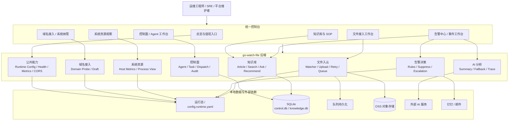
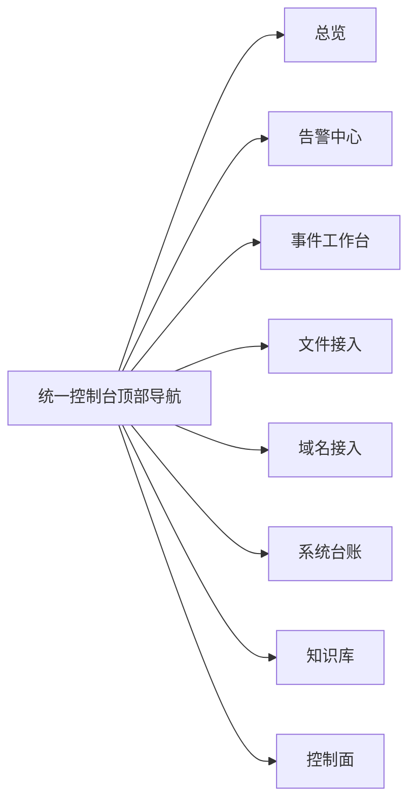
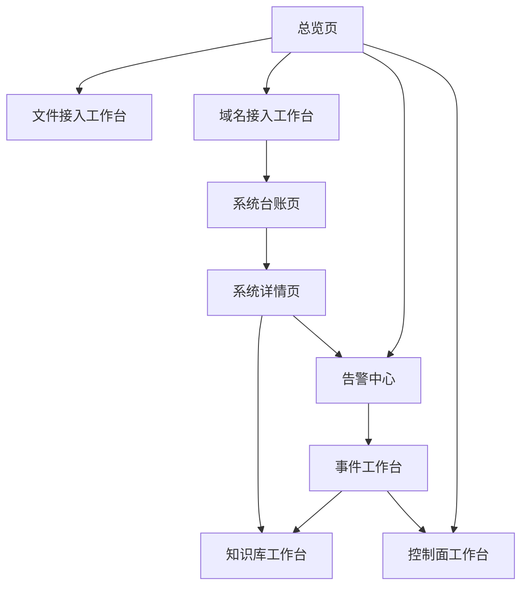
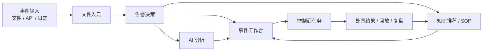
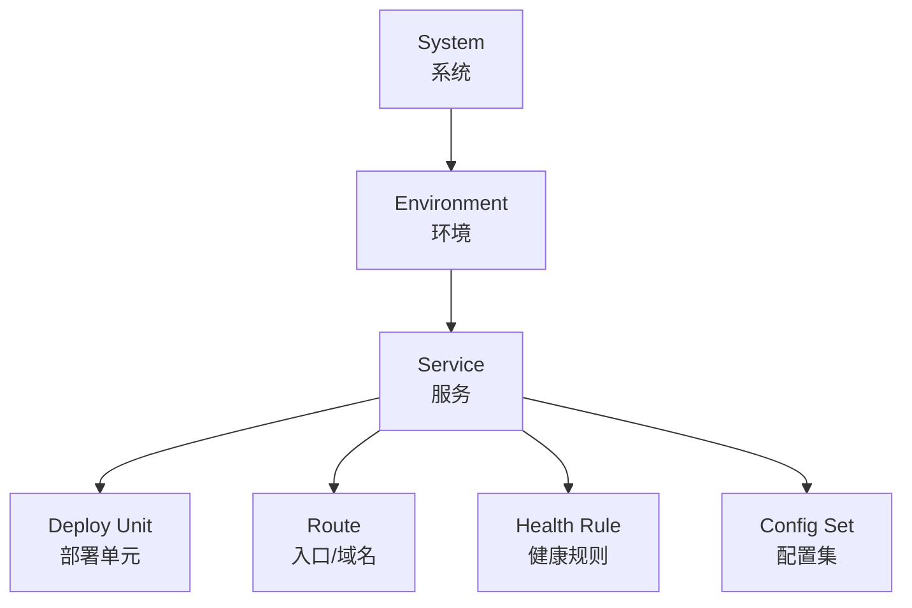

# 统一运维平台架构草图（2026-03-20）

> 文档状态：现行架构草图  
> 适用范围：用于统一控制台、系统纳管、事件闭环的原型讨论与后续 UI / 信息架构设计  
> 对齐口径：以 `docs/01-平台定位/项目定位与主线能力.md`、`docs/02-架构设计/总体架构说明.md`、`docs/03-能力模块/功能模块说明.md`、`docs/04-路线图与计划/多环境系统纳管与配置治理方案-2026-03-19.md` 为准

## 1. 本草图要解决什么

当前 GWF 已经具备：

- 文件入云
- 告警决策
- AI 分析与降级
- 知识库复用
- 控制面、系统资源、域名接入等支撑能力

但从“平台形态”看，仍然缺一套足够统一的图形化表达，来回答下面这些问题：

1. 这到底是不是一个完整的运维事件闭环平台？
2. 当前主线和支撑能力分别在平台的哪一层？
3. 后续“域名接入 + 系统台账 + 健康探测”应该怎么并到统一控制台，而不是另起炉灶？
4. 如果后面要重做 UI，信息架构应该怎样排，才能符合当前阶段范围，而不是画成大而全平台？

这份草图的目标不是替代详细设计，而是先把“平台长什么样、模块怎么协同、页面怎么组织”统一出来。

## 2. 平台目标形态图



### 这张图的核心含义

- 平台的中心不是“某一个模块页面”，而是“统一控制台”。
- 主线能力仍然是：`文件入云 + 告警决策 + AI 分析 + 知识库复用 + 统一控制台闭环`。
- `域名接入` 和后续 `系统纳管` 不应该单独变成第二个平台，而应该并入统一控制台中的“纳管入口”。

## 3. 能力分层图

```mermaid
flowchart TB
  subgraph L1[交互层]
    U1[总览 / 值班]
    U2[告警 / 事件]
    U3[接入 / 纳管]
    U4[知识 / SOP]
    U5[控制面 / 执行]
  end

  subgraph L2[平台能力层]
    P1[文件入云]
    P2[告警决策]
    P3[AI 分析与降级]
    P4[知识库复用]
    P5[域名探测与接入草案]
    P6[系统台账与健康规则]
  end

  subgraph L3[执行与观测层]
    E1[控制面 Agent / Task]
    E2[系统资源采集]
    E3[通知通道]
    E4[/metrics / health / dashboard]
  end

  subgraph L4[状态与存储层]
    D1[运行态]
    D2[SQLite]
    D3[队列持久化]
    D4[OSS]
    D5[外部 AI]
  end

  L1 --> L2
  L2 --> L3
  L3 --> L4
```

### 分层原则

1. 顶层是“运维工作流入口”，不是技术模块清单。
2. 中层才是平台能力。
3. 底层执行与存储只负责承接能力，不直接决定页面结构。

这很关键，因为如果把页面直接按技术模块排，UI 很容易做成“后端接口目录”，而不是“运维工作台”。

## 4. 统一控制台信息架构图

### 4.1 顶部导航建议



### 4.2 页面关系图



### 4.3 为什么这样组织

- `总览` 是值班入口，不是某一模块首页。
- `告警中心` 负责批量处理，“事件工作台”负责单事件深度处置。
- `域名接入` 是接入入口；`系统台账` 是接入结果沉淀。
- `系统详情页` 是“纳管完成后的运维视图”，后续会自然承接健康、配置、SOP、历史事件。

## 5. 运维事件闭环图



### 对应当前规划

- 这条闭环和主线文档完全一致。
- `结果 -> KB` 这一步很重要，它保证平台不是“一次性排障工具”，而是能越来越好用。

## 6. 域名接入与系统纳管闭环图


### 这张图对应的阶段口径

- 当前已落地：`域名探测原型`
- 下一步建议落地：`接入草案 -> 台账骨架`
- 后续增强：`台账 -> 健康规则 -> 告警联动`

也就是说，域名接入不是终点，它只是纳管入口。

## 7. 最小纳管模型关系图



### 建议的详情页映射

| 模型对象 | 在页面上怎么展示 |
| --- | --- |
| `System` | 系统卡片、系统详情头部 |
| `Environment` | `prod/test/temp` 环境切换 |
| `Service` | 服务列表与服务状态块 |
| `Route` | 域名、路径、反代信息 |
| `Health Rule` | 健康接口、探测频率、告警级别 |
| `Config Set` | 配置完整度、敏感项来源、最近核验时间 |
| `Deploy Unit` | docker / jar / static / script 等运行形态 |

## 8. 低保真页面框图

下面不是最终 UI，而是为了先确认“排版结构是否符合系统规划”。

### 8.1 平台总壳层

```text
┌──────────────────────────────────────────────────────────────────────┐
│ GWF | 总览 | 告警中心 | 事件工作台 | 文件接入 | 域名接入 | 系统台账 | 知识库 | 控制面 │
│ Search | 环境切换 | 时间范围 | 当前值班人 | 通知                         │
├──────────────────────────────────────────────────────────────────────┤
│ 页面标题 + 页面说明                                                   │
│ 页面内二级 Tab / 页面筛选条                                           │
├──────────────────────────────────────────────────────────────────────┤
│ 页面内容区                                                             │
└──────────────────────────────────────────────────────────────────────┘
```

### 8.2 平台总览页

```text
┌─────────────────────────────────────────────────────────────┐
│ 全局状态条：在线系统 / 未恢复告警 / 待处理事件 / 接入异常 / backlog │
├───────────────────────────────┬─────────────────────────────┤
│ 告警趋势 / 事件时间线          │ 系统健康分布 / 环境分布      │
├───────────────────────────────┼─────────────────────────────┤
│ 待办事项                       │ 最近变更 / 最近回放 / 失败原因 │
└───────────────────────────────┴─────────────────────────────┘
```

### 8.3 文件接入工作台

```text
┌─────────────────────────────────────────────────────────────┐
│ 接入状态条：监控目录数 / 队列长度 / 失败率 / 重试次数 / 最近上传 │
├───────────────────────┬───────────────────────┬─────────────┤
│ 目录与监控范围         │ 文件列表 / 上传队列     │ 文件日志 + AI 分析 │
├───────────────────────┴───────────────────────┼─────────────┤
│ 上传趋势 / 失败原因分布                        │ 上传记录     │
└───────────────────────────────────────────────┴─────────────┘
```

### 8.4 域名接入工作台

```text
┌─────────────────────────────────────────────────────────────┐
│ 输入域名 + 开始探测 + 导出 JSON                               │
├─────────────────────────────────────────────────────────────┤
│ 接入摘要：建议接入类型 / 建议入口 / TLS 状态 / 待确认事项数     │
├───────────────────────┬───────────────────────┬─────────────┤
│ DNS                   │ HTTP / HTTPS          │ TLS         │
├───────────────────────────────────────────────┬─────────────┤
│ 候选健康接口                                   │ 待确认事项   │
├───────────────────────────────────────────────┴─────────────┤
│ 原始探测结果 JSON                                                │
└─────────────────────────────────────────────────────────────┘
```

### 8.5 系统详情页

```text
┌─────────────────────────────────────────────────────────────┐
│ 系统标题 + 环境切换 + 健康状态 + 责任人                       │
├───────────────────────────────┬─────────────────────────────┤
│ 服务拓扑 / 部署形态            │ 入口与健康规则               │
├───────────────────────────────┼─────────────────────────────┤
│ 配置完整度 / 敏感项来源        │ SOP / 知识 / 最近事件         │
└───────────────────────────────┴─────────────────────────────┘
```

## 9. 与当前阶段规划的匹配关系

### 9.1 当前阶段 A 必须保留为主视觉的内容

这些是当前阶段真正要强调的，不应该在原型里被弱化：

1. 文件入云稳定性
2. 告警决策与 AI 分析
3. 知识复用
4. 统一控制台闭环
5. 域名接入作为下一步纳管入口

### 9.2 当前阶段不要画得过重的内容

这些内容可以在图里点到，但不要画成当前主舞台：

- 完整多租户
- 复杂 RBAC
- 配置中心推拉
- 全自动发布编排
- 大而全 CMDB

原因很简单：它们不符合当前阶段范围边界。

## 10. 建议的原型输出顺序

如果你接下来要进入 UI / 产品原型阶段，我建议按下面顺序出图：

1. 平台总壳层
2. 平台总览页
3. 文件接入工作台
4. 域名接入工作台
5. 告警中心
6. 事件工作台
7. 系统台账页
8. 系统详情页
9. 控制面工作台

这样做的原因：

- 先定平台壳层，避免后面每个页面导航结构都不一样。
- 先定文件接入和域名接入，因为这两个最贴近当前主线 + 下一步纳管切口。
- 告警、事件、控制面则在平台壳层稳定后再做高保真。

## 11. 本草图的使用方式

这份草图适合用来做三件事：

1. 确认“平台到底长什么样”
2. 作为后续 UI 原型和前端重构的共同基线
3. 避免后续把系统画成“接口堆叠后台”，而不是“运维事件闭环平台”

如果下一步继续推进，建议基于本草图先出 4 张低保真原型：

- 平台总壳层
- 平台总览页
- 文件接入工作台
- 域名接入工作台
