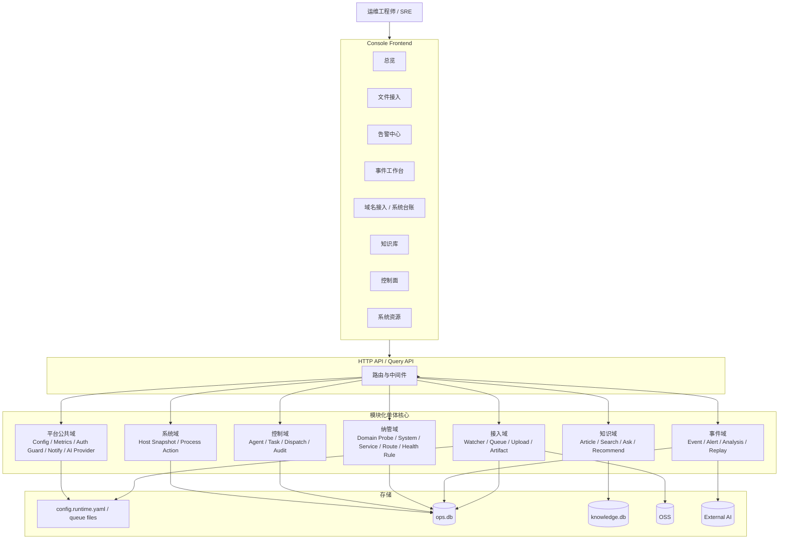

# 统一运维平台重设计方案（2026-04-17）

> 文档状态：建议稿（重设计）  
> 适用范围：`GWF` 当前仓库，面向阶段 A 收口与后续 2~4 个迭代的可落地演进  
> 基线来源：以 2026-04-17 仓库代码、主线文档口径、`go test ./... -count=1` 与 `npm run build` 结果为准  
> 约束前提：仍然遵守当前阶段范围冻结，不引入“为了平台化而平台化”的重型方案

## 1. 本次重设计要解决什么

当前系统已经不是“没有能力”，而是“能力已经堆出来了，但边界开始变模糊”。

从业务目标看，GWF 的主线一直很清晰：

- 文件入云
- 告警决策
- AI 分析与降级
- 知识库复用
- 统一控制台闭环

问题不在于方向错了，而在于现在的实现方式已经出现三个明显信号：

1. 后端正在朝“单进程聚合式大单体”继续膨胀。
2. 前端正在朝“单页大组件控制台”继续膨胀。
3. 主线闭环已经存在，但还缺一条真正稳定的“事件骨架”，导致接入、告警、AI、知识、处置、回放之间的关联还不够自然。

所以这次重设计的目标不是推倒重来，而是做三件更务实的事：

1. 保住当前可用能力，不打断主线。
2. 把系统从“能跑的大单体”重整为“边界清楚的模块化单体”。
3. 围绕“事件闭环”补齐统一数据骨架，为后续纳管、回放、追溯、知识回写提供稳定支点。

## 2. 当前系统诊断

## 2.1 已有优点

先明确系统的优点，这些应该保留，而不是在重设计里被误伤：

- 后端主链路已经具备实际可运行能力，不是 PPT 架构。
- 文件入云链路有静默窗口、队列、重试、回压、持久化恢复，可靠性意识是对的。
- 告警链路已经有规则、抑制、升级、通知和解释信息。
- AI 分析已经做了失败分类和降级兜底，不是“调用模型失败就整个接口报废”。
- 知识库已经具备生命周期、版本、回滚、推荐、引用和评审。
- `/api/dashboard`、`/api/dashboard?mode=light`、`/api/health` 已经考虑了降级与匿名可读。
- 当前后端测试通过，前端可构建，说明系统仍处于“可重整”而不是“先抢修”的阶段。

本轮本地验证基线如下：

- 后端：`cd go-watch-file && go test ./... -count=1` 通过
- 前端：`cd console-frontend && npm run build` 通过
- 前端构建有 chunk 过大告警：主包约 `543.09 kB`，说明技术上已需要拆包

## 2.2 关键问题

### 问题 1：后端聚合过重，HTTP 层承担了过多领域职责

当前后端的核心特征是：功能都在一个可执行进程里，但领域边界没有完全沉到底层。

直接证据：

- `go-watch-file/internal/api/server.go` 约 `1061` 行，直接注册 `28` 个路由。
- `go-watch-file/internal/service/file_service.go` 负责配置热更新、Watcher、上传、通知、运行态、告警协作。
- `go-watch-file/internal/api/control_handlers.go` 约 `698` 行，控制面领域逻辑仍在 API 包里。
- `go-watch-file/internal/api/ai_log_summary.go` 约 `885` 行，AI 调用、压缩、重试、降级、解析都聚在一个接口文件里。
- `go-watch-file/internal/api/kb_handlers.go` 约 `910` 行，说明知识库接口层也已明显过重。

这会带来三个后果：

1. 路由层不是单纯编排层，而是事实上的“应用服务层 + 领域协调层”。
2. 一个领域改动经常要穿过 `api -> service -> state -> models` 多层散落逻辑。
3. 后续想做“事件主线统一收口”时，会发现很多状态更新点并不在同一个边界内。

### 问题 2：主线闭环存在，但缺少统一的事件骨架

当前系统已经有这些“局部关联”：

- 文件上传结果会进入运行态和图表
- 告警决策会记录 `alertId`
- 知识推荐会以 `alertId` 关联 `knowledgeTrace`
- AI 分析可返回结构化摘要和降级原因

但从整个闭环看，系统仍缺一个统一的第一公民对象，例如：

- `Event`：原始输入事件
- `Incident`：需要跟踪处置的事件单元
- `Analysis`：AI 与规则化诊断结果
- `KnowledgeLink`：知识引用与回写
- `Replay`：回放与复盘快照

现在很多链路还是“某个模块自己有一份状态”，而不是“大家围绕同一个事件主键协作”。这会导致：

- 事件工作台更像页面组织，而不是系统级数据组织。
- AI、告警、知识推荐、控制任务之间的追溯粒度不统一。
- 以后接入“域名纳管”“系统台账”“健康检查”时，很难自然并到同一条事件闭环。

### 问题 3：运行态、配置、持久化边界还不够清楚

当前系统同时存在多类状态：

- 基础 YAML 配置
- `.env` 环境变量覆盖
- `config.runtime.yaml` 运行时白名单覆盖
- 内存运行态 `state.RuntimeState`
- 持久化上传队列文件
- `control.db`
- `knowledge.db`

这些设计本身都合理，但现在的问题是“缺统一边界”：

- 哪些是运行时状态，哪些是审计状态，哪些是业务事实，边界没有被完整建模。
- 配置热更新白名单由 `FileService` 驱动，控制面与告警也部分走同一路。
- API 层、服务层、配置层都可能直接读 `models.Config`。

这在当前规模还能工作，但继续扩下去会出现：

- 某个行为到底受 YAML、ENV、runtime override 还是内存状态影响，不容易一眼判断。
- 做审计或回放时，很难还原“当时真实生效的配置视图”。

### 问题 4：前端已经从“页面”演进成“控制台”，但技术架构还停留在单页聚合模式

前端信息架构方向是对的，已经在向统一控制台靠拢；但技术实现已经明显落后于页面复杂度。

直接证据：

- `console-frontend/src/OriginalConsole.tsx` 约 `1230` 行。
- `console-frontend/src/AlertConsole.tsx` 约 `1934` 行。
- `console-frontend/src/KnowledgeConsole.tsx` 约 `1035` 行。
- `console-frontend/src/console/ConsoleSections.tsx` 约 `722` 行。
- 顶层仍然用本地状态驱动视图切换，而不是正式路由与页面模块。
- 多个页面各自管理轮询、错误处理、筛选状态和接口调用。

这会造成：

1. 页面就是模块边界，复用困难。
2. “同样的请求/轮询/错误处理”在多个页面重复实现。
3. 首屏 bundle 持续变大，无法按页面或能力懒加载。
4. 页面之间很难共享统一的“事件上下文”。

### 问题 5：控制面、纳管、系统资源还在“支撑能力”阶段，但技术上已经开始侵入主线骨架

当前阶段的正确策略应该是：

- 控制面服务主线
- 系统资源服务主线
- 域名接入服务纳管入口

但现在这些能力仍较多地以“并列模块”的方式存在，而没有统一挂在“事件闭环”和“系统纳管”两条主线之下。

这会导致后续容易出现两类偏航：

1. 控制面做成一个独立小平台，反向绑架主线。
2. 系统纳管、域名接入、健康检查越做越像独立 CMDB，而不是主线闭环的前置入口。

### 问题 6：安全和可观测底线需要从“功能有了”提升到“平台默认”

当前阶段明确不做完整 RBAC，但并不等于不做安全边界。

当前最明显的缺口有：

- 管理接口默认匿名可访问。
- CORS 未配置白名单时默认放开。
- 缺少统一请求 ID / 事件 ID / 审计链路贯通。
- 控制台高频轮询较多，但接口级 cache、版本、并发控制策略仍主要靠页面自己处理。

这意味着当前系统适合内网和 MVP 阶段，但如果继续扩大使用面，必须先补“最小安全闸”和“最小追踪链”。

## 3. 重设计原则

## 3.1 不拆微服务，先做模块化单体

当前阶段最不应该做的事情，就是把一个还能控制的系统拆成多套服务、多个仓库、多个部署单元。

本阶段建议坚定采用：

- 单仓库
- 单后端可执行进程
- 多模块、清边界、可演进

也就是“模块化单体”，而不是“分布式补复杂度”。

## 3.2 一切围绕事件闭环，而不是围绕接口目录

新的系统骨架必须以事件为中心，而不是以页面或接口为中心。

核心对象顺序建议统一为：

`Input -> Event -> Alert Decision -> Analysis -> Knowledge Link -> Action/Task -> Replay`

这样做之后：

- 文件入云是事件入口，不再只是上传功能。
- 告警中心是事件筛选器，不再只是日志规则面板。
- 事件工作台才会有稳定的数据主键。
- 知识回写和回放才能自然落地。

## 3.3 保持兼容演进，不搞“一次性大迁移”

本次重设计必须默认采用“双轨迁移”：

- 旧接口继续保留
- 新领域服务逐步接管
- 旧页面逐步迁移到新页面壳层

其中三个兼容约束必须保留：

- `/api/health` 继续匿名可读
- `/api/dashboard` 与 `/api/dashboard?mode=light` 在运行态未就绪时仍返回 `200 + 降级结构`
- 文件入云仍然优先支持本地文件监控，不把主线切到分布式输入源

## 3.4 支撑能力必须挂靠主线，不反向定义主线

控制面、系统资源、域名纳管都要服务于：

- 事件决策效率
- `MTTD/MTTR`
- 可观测性
- 安全性

任何新设计如果只是让平台“看起来更完整”，但没有提升这四项，就不应该进入本阶段核心骨架。

## 4. 目标架构



这张图有三个关键信号：

1. 后端仍然是单体，但不再是“一个大 service + 一个大 handler”。
2. `ops.db` 负责事件闭环、控制面、纳管、审计等运行事实；`knowledge.db` 保持知识库独立生命周期。
3. HTTP API 退回到路由与 DTO 适配层，不再承担核心领域逻辑。

## 5. 模块边界重整

## 5.1 接入域 `ingest`

职责：

- 文件监听
- 手动/API 入队
- 队列持久化与回压
- 上传执行
- 对象引用生成

输入：

- 本地文件事件
- 手动上传请求

输出：

- `EventInput`
- 上传结果
- Artifact 引用

当前代码映射建议：

- `watcher`
- `upload`
- `persistqueue`
- `oss`
- `service` 中与上传相关部分
- `state` 中与上传快照相关部分

## 5.2 事件域 `incident`

职责：

- 接收输入事件
- 规则判断与告警决策
- AI 分析与降级
- 知识推荐关联
- 回放与追溯

输入：

- `EventInput`
- 告警日志源
- 手动分析请求

输出：

- `IncidentEvent`
- `AlertDecision`
- `AnalysisReport`
- `KnowledgeLink`

当前代码映射建议：

- `alert`
- `api/ai_log_summary.go`
- 事件工作台相关查询聚合

## 5.3 知识域 `knowledge`

职责：

- 条目生命周期
- 检索、问答、推荐
- 评审、回滚、质量门禁

输入：

- 文档导入
- 问答请求
- 告警/事件上下文

输出：

- 引用结果
- 推荐结果
- 审核记录

当前代码映射建议：

- `kb`
- `api/kb_handlers.go`

## 5.4 纳管域 `registry`

职责：

- 域名接入探测
- 系统 / 环境 / 服务 / 入口 / 健康规则台账
- 待确认项与模板学习

输入：

- 域名探测请求
- 台账维护请求

输出：

- 接入草案
- 系统台账
- 健康规则

当前代码映射建议：

- `api/registry_domain_probe.go`
- 后续系统台账模型

## 5.5 控制域 `control`

职责：

- Agent 注册/心跳
- 任务创建/分发/状态迁移
- 审计日志

输入：

- 控制台操作
- Agent 上报

输出：

- 任务状态
- 审计链路

当前代码映射建议：

- `api/control_handlers.go`
- `api/control_dispatch.go`
- `api/control_store.go`
- `api/control_audit.go`

## 5.6 系统域 `system`

职责：

- 主机资源快照
- 进程视图
- 轻量处置

输入：

- 系统查询
- 终止请求

输出：

- 资源快照
- 进程动作结果

当前代码映射建议：

- `sysinfo`
- `api/system*` 相关逻辑

## 5.7 平台公共域 `platform`

职责：

- 配置加载与生效视图
- 日志、指标、请求 ID
- 最小安全闸
- 通知通道
- AI Provider 适配

当前代码映射建议：

- `config`
- `logger`
- `metrics`
- `dingtalk`
- `email`
- `models` 中公共结构

## 6. 核心数据模型重设计

这部分是本次重设计最关键的内容。系统后续是否真正闭环，取决于数据骨架是否统一。

## 6.1 EventInput

表示进入系统的原始输入。

建议字段：

- `event_id`
- `source_type`：`file/manual/api/log/docker/domain_probe`
- `source_ref`
- `artifact_ref`
- `observed_at`
- `ingest_status`
- `fingerprint`
- `labels`

作用：

- 统一文件、日志、手动输入的起点
- 为后续事件工作台提供稳定入口

## 6.2 Incident

表示需要追踪的运维事件单元。

建议字段：

- `incident_id`
- `event_id`
- `title`
- `severity`
- `status`
- `owner`
- `opened_at`
- `closed_at`
- `latest_analysis_id`

作用：

- 把“上传记录、告警记录、AI 摘要、知识推荐”收口到一个工作对象上

## 6.3 AlertDecision

表示规则引擎和升级逻辑的结果。

建议字段：

- `decision_id`
- `incident_id`
- `rule_id`
- `decision_kind`
- `notify`
- `suppressed`
- `suppressed_by`
- `explain_json`
- `decided_at`

作用：

- 保留当前解释性优势
- 从“告警列表数据”升级为可追溯业务事实

## 6.4 AnalysisReport

表示 AI 分析或降级分析结果。

建议字段：

- `analysis_id`
- `incident_id`
- `provider`
- `mode`
- `summary`
- `severity`
- `confidence`
- `degraded`
- `error_class`
- `used_lines`
- `created_at`

作用：

- 保留 AI 分析的回放价值
- 将当前接口响应里的 `meta` 固化为可查询事实

## 6.5 KnowledgeLink

表示知识推荐、引用和回写关系。

建议字段：

- `link_id`
- `incident_id`
- `analysis_id`
- `query`
- `hit_count`
- `articles_json`
- `linked_at`

作用：

- 让知识库不再只是“被动搜索”，而是闭环的一部分

## 6.6 Registry 实体

面向后续纳管，建议统一 5 类台账实体：

- `system`
- `environment`
- `service`
- `route`
- `health_rule`

作用：

- 与 2026-03-19 的多环境纳管方案直接对齐
- 后续将域名探测从“原型接口”演进为“真实纳管入口”

## 7. 后端重构方案

## 7.1 目录建议

为保证 Go 新手也能接手，目录不建议一次性切成过深的 DDD 结构，而是采用“按领域模块 + 每模块内部清层”的方式。

建议目标目录：

```text
go-watch-file/internal/
  api/
    router.go
    middleware.go
    compat_dashboard.go
    compat_health.go
  platform/
    config/
    logger/
    metrics/
    notify/
    ai/
    auth/
  ingest/
    service.go
    watcher.go
    queue.go
    upload.go
    repository.go
    types.go
  incident/
    service.go
    alert_engine.go
    analysis.go
    replay.go
    repository.go
    types.go
  knowledge/
    service.go
    repository.go
    search.go
    types.go
  registry/
    probe.go
    catalog.go
    repository.go
    types.go
  control/
    service.go
    dispatch.go
    audit.go
    repository.go
    types.go
  system/
    service.go
    collector.go
    repository.go
    types.go
```

迁移原则：

- 旧包不必一口气删除
- 新模块先长出来，再逐步把旧逻辑挪进去
- `api` 包最后只保留路由、DTO、兼容层和中间件

## 7.2 API 重组策略

不建议继续让 `/api/dashboard` 成为“所有事情都往里塞”的总汇接口。

建议 API 分三类：

1. `compat` 兼容接口
2. `query` 查询接口
3. `command` 执行接口

建议映射如下：

| 现状 | 目标 |
| --- | --- |
| `/api/dashboard` | 保留兼容；内部改为聚合 `/api/overview/*` 与 `/api/ingest/*` |
| `/api/manual-upload` | 收敛到 `/api/ingest/uploads:enqueue` 或等价命令接口 |
| `/api/file-log` | 收敛到 `/api/ingest/files/log` |
| `/api/ai/log-summary` | 收敛到 `/api/incidents/analysis` 或 `/api/events/analysis` |
| `/api/alerts` | 拆成 `/api/incidents/summary` 与 `/api/incidents/list` |
| `/api/control/*` | 保留路径前缀，但逻辑迁入 `control` 域 |
| `/api/kb/*` | 路径可基本保留，逻辑迁入 `knowledge` 域 |
| `/api/registry/domain-probe` | 保留，并逐步扩展系统台账接口 |

本阶段不追求 REST 绝对纯粹，重点是：

- 路由按领域分组
- 查询与执行分离
- 兼容层兜住旧控制台

## 7.3 接入主链路重构

当前 `FileService` 职责过多，建议拆为以下协作对象：

- `IngestService`：接收文件事件、手动上传、队列策略
- `UploadExecutor`：执行上传、重试、回压、持久化恢复
- `ArtifactStore`：管理 `local://` / `oss://` 引用
- `RuntimeSnapshotService`：生成 dashboard 需要的轻量快照

这样做的好处：

- 上传可靠性仍保留
- 运行态快照不再和执行编排硬绑在一个对象上
- AI/告警后续读取日志时，可以通过 `ArtifactStore` 或 `LogReader` 统一拿数据

## 7.4 事件闭环重构

建议把“告警 + AI + 知识推荐”改成一条明确流水线：

```text
EventInput
  -> IncidentService.OpenOrMerge
  -> AlertEngine.Decide
  -> AnalysisService.SummarizeOrFallback
  -> KnowledgeService.Recommend
  -> ControlService.CreateActionTask (按需)
  -> ReplayService.Record
```

关键点：

- 告警不是终点，只是 Incident 的一个决策步骤。
- AI 分析结果必须落库，而不是只停留在接口响应里。
- 知识推荐必须挂在 `incident_id` 上，而不是只挂 `alertId`。
- 控制面任务必须是“事件闭环的动作结果”，而不是独立系统。

## 7.5 配置与安全重构

建议把配置生效模型显式分成三层：

1. `base config`：YAML
2. `env override`：环境变量
3. `runtime override`：运行时白名单

同时补两项最小能力：

- `effective config snapshot`：可查询当前真实生效配置
- `request_id / incident_id`：贯通日志、指标、审计

安全上，本阶段建议只补最小闸门：

- `/api/health` 永远匿名开放
- `/api/dashboard` 保持匿名降级可读
- 其余写接口支持最小接入限制：反向代理白名单、可选 Token、审计落库

这里不引入完整 RBAC，但也不能继续把“全匿名管理接口”当成长期默认。

## 8. 前端重构方案

## 8.1 目标形态

前端建议从“一个巨型控制台组件”演进为“平台壳层 + 分页工作台”。

建议结构：

```text
console-frontend/src/
  app/
    AppShell.tsx
    routes.tsx
  pages/
    OverviewPage/
    IngestPage/
    AlertPage/
    EventPage/
    RegistryPage/
    RegistryCatalogPage/
    KnowledgePage/
    ControlPage/
    SystemPage/
  features/
    incident/
    ingest/
    knowledge/
    control/
    registry/
    system/
  shared/
    api/
    hooks/
    components/
    types/
    utils/
```

## 8.2 页面组织

建议页面与主线一一对应：

- `OverviewPage`：值班总览
- `IngestPage`：文件接入与上传运行态
- `AlertPage`：告警批量处理
- `EventPage`：单事件工作台
- `RegistryPage`：域名接入引导
- `RegistryCatalogPage`：系统台账
- `KnowledgePage`：知识条目与问答
- `ControlPage`：任务、事件、审计
- `SystemPage`：主机资源与轻量处置

## 8.3 状态与请求策略

当前每个页面都在自己管理轮询、错误、加载和数据缓存。重构后建议统一成：

- 页面级数据通过特性 hooks 获取
- 轮询策略放到特性层而不是页面 JSX
- 同类资源共享同一请求封装与错误归一化

本阶段不强制引入重型状态管理；如果继续保持轻量实现，也至少需要：

- 统一 API client
- 统一 polling hook
- 统一 query key 命名
- 统一错误展示与空态展示

## 8.4 路由与拆包

当前构建已经提示主包过大，因此前端必须引入页面级懒加载。

建议：

- 页面对应用壳层使用 `lazy` 拆包
- 告警、知识、控制面等大页面按页面维度切 chunk
- 图表、重编辑器、对比视图等非首屏模块延迟加载

目标不是追求极致前端工程化，而是先解决：

- 首屏过重
- 页面边界不清
- 状态重复

## 9. 分阶段迁移路径

## 9.1 阶段 0：先补架构地基，不动外部行为

目标：

- 新建领域目录
- 新建兼容路由壳层
- 增加 `request_id`
- 增加 `incident_id` 基础模型

产物：

- 新目录结构
- 兼容 router
- 基础模型与 repository 接口

## 9.2 阶段 1：先重构后端主线，不动前端信息架构

目标：

- 拆 `FileService`
- 拆 `server.go`
- 把控制面与 AI 分析逻辑迁出 API 包

产物：

- `ingest` / `incident` / `control` 服务层
- `/api/dashboard` 兼容聚合仍可用

## 9.3 阶段 2：补齐事件骨架与查询面

目标：

- 引入 `EventInput / Incident / AnalysisReport / KnowledgeLink`
- 新增 `overview` 与 `incident` 查询接口
- 让回放、告警、AI、知识推荐统一挂载到 `incident_id`

产物：

- `ops.db` 新表
- 事件工作台真实数据源

## 9.4 阶段 3：前端换壳，不一次性重写页面

目标：

- 引入正式路由
- 用新壳层承载旧页面
- 分页懒加载

产物：

- `AppShell`
- route-based pages
- chunk 拆分

## 9.5 阶段 4：纳管与控制面并入主线

目标：

- 域名接入探测结果写入台账
- 系统台账挂到事件与知识上下文
- 控制任务从“独立面板”变成“事件动作面板”

产物：

- `registry` 实体
- `event -> task -> audit` 贯通链路

## 10. 本阶段明确不做

下面这些方向在本次重设计中明确不进入核心实施面：

- 不拆微服务
- 不引入分布式消息队列作为主链路依赖
- 不做完整多租户与细粒度 RBAC
- 不做全自动处置全量放开
- 不做重型 CMDB 或配置中心
- 不为了“看起来高级”引入复杂分层与过深抽象

## 11. 预期收益

如果按这套方案推进，预期收益不是“页面更多了”，而是下面这些更实在的结果：

1. 后端可以继续保持单部署单元，但每次改动不再牵一发动全身。
2. 事件工作台将真正拥有统一主键，告警、AI、知识、任务、回放可自然串起来。
3. 前端会从“大组件堆叠”回到“页面壳层 + 特性模块”的健康结构。
4. 域名接入、系统纳管、控制面会挂靠到事件闭环，而不是长成三套并列平台。
5. 后续不管是优化 `MTTD/MTTR`、补安全闸，还是补可观测，都有清晰落点。

## 12. 结论

GWF 当前最适合的方向，不是推倒重来，也不是继续往现有结构上堆功能，而是做一次“以事件闭环为中心的模块化重整”。

一句话概括这次重设计：

`保持单体部署，重整领域边界，补齐事件骨架，前端换壳分页，支撑能力全部挂靠主线。`

这条路线既符合当前阶段 A 的范围约束，也能为下一阶段的纳管、控制面深化、指标收口和 AI 质量治理留出足够清晰的演进空间。
