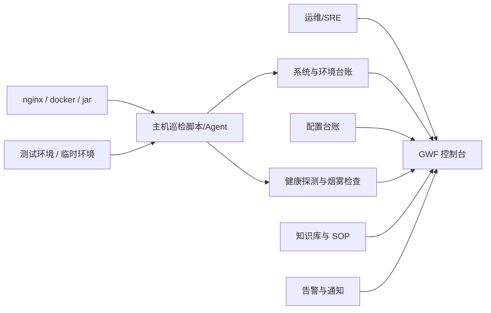

# 多环境系统纳管与配置治理方案（2026-03-19）

> 文档状态：现行专题方案  
> 校准日期：2026-03-19  
> 适用范围：GWF 当前“多系统、多环境、分散服务器”的纳管与治理设计  
> 目标：在不引入重型平台的前提下，把“系统台账、健康感知、配置治理、新系统接入”收敛到同一控制面，优先解决环境变量杂乱、服务状态不可感知、接入标准不统一的问题，并逐步形成“填写域名即可开始接入”的快速纳管模式。

## 1. 背景与问题

结合当前实际运维方式，可以归纳出 5 个持续放大的问题：

1. 系统数量持续增长，且每个系统通常同时存在 `test/prod/临时环境`，部署在不同服务器上，靠人脑记忆已经不可持续。
2. 发布形态混用明显：前端以 `dist + nginx` 为主，后端同时存在 `docker-compose`、独立 `jar`、宿主机依赖、旁路脚本，缺少统一纳管入口。
3. 当前 Prometheus/Grafana 主要覆盖 JVM 和部分容器指标，但“不好用”“页面白屏”“域名证书失效”“反向代理错误”“依赖超时”等问题不一定会体现在 JVM 指标里，导致故障常常先由产品或业务反馈。
4. 环境变量与配置项分散在 `docker-compose.yml`、`.env`、宿主机脚本、Nginx 配置、人工命令中，重复、漂移和遗漏都很常见。
5. 新系统接入时缺少最小标准，常常是“先跑起来再说”，后续再补监控、补文档、补告警，结果就是越积越乱。

从你给出的示例可以直接看到几个典型风险：

- 同一个后端服务的配置同时分散在 `docker-compose.yml` 与 `.env` 中，存在重复定义与真实生效值难以确认的问题。
- 数据库、Redis、OSS、短信、AI、JWT 等敏感配置直接明文散落在部署文件中，存在较高安全风险。
- 生产域名对应的部署示例里仍出现 `NODE_ENV=dev`、`SPRING_PROFILES_ACTIVE=dev` 这类环境漂移信号，后续排查会非常痛苦。
- Nginx 路由、静态文件目录、后端端口、健康检查地址之间缺少统一台账，只能靠登录服务器后逐个查看。

结论很明确：当前最缺的不是“再加一个监控图表”，而是先建立一套轻量、统一、能持续接入的纳管底座。

## 2. 设计原则

本方案遵循以下原则，避免一上来就走向过度设计：

1. 不先上重型平台。
当前场景仍以 `nginx + docker-compose + jar + 少量脚本` 为主，不建议为了“统一”直接切到 Kubernetes、Service Mesh 或自研完整 PaaS。

2. 先纳管，后自动化。
先把“系统有哪些、跑在哪、谁负责、如何判断可用、配置从哪里来”梳理清楚，再逐步做自动发现、自动巡检、自动接入。

3. 先统一事实源，再做控制台展示。
短期建议先建立统一资产与配置台账；GWF 负责展示、告警与闭环，而不是一开始就做成全功能配置中心。

4. 敏感信息单独治理。
环境变量并不等于配置治理。真正需要优先治理的是“哪些值能入库、哪些值必须脱敏、哪些值需要轮换、哪些值只允许引用不允许明写”。

5. 接入标准必须足够小。
新系统接入时，只要求最小必要字段与健康检查，不要求一次性补齐所有自动化能力，避免因为标准过重导致没人接入。

6. 方案必须服务 `MTTD/MTTR`。
所有新增设计都要能回答两个问题：是否更早发现问题？是否更快定位和恢复？

7. 域名优先，但域名不是唯一事实源。
域名最适合做“接入起点”和“入口探测锚点”，因为它最贴近真实用户访问路径；但同一个系统可能有多个域名，同一个域名也可能同时承载前端、API、静态资源和代理规则，因此后续仍要补齐服务、环境、部署与配置台账。

## 3. 阶段边界

为了符合当前仓库“范围冻结”的要求，本方案按 A/B/C 三类划分：

### 3.1 A 类（建议立即推进）

- 建立统一系统台账与环境台账。
- 定义新系统最小接入标准。
- 建立多层健康感知，补齐“域名入口可用性”与“关键接口烟雾检查”。
- 统一环境变量分类与文件组织方式。
- 清理部署文件中的明文敏感配置，至少完成“引用替代 + 权限收口 + 轮换计划”。

### 3.2 B 类（下一阶段优先）

- 从服务器自动采集 `nginx/conf.d`、`docker-compose.yml`、`systemd unit`、容器状态等信息。
- 增加配置漂移检测，识别“台账写的是 prod，实际跑的是 dev 配置”之类问题。
- 将接入信息直接接到 GWF 控制台，以服务卡片、环境概览、探测结果、SOP 链接形式展示。
- 支持批量巡检、过期临时环境提醒、下线环境归档。

### 3.3 C 类（当前暂缓）

- 自研完整配置中心推拉模型。
- 全自动发布编排、审批流、灰度发布系统。
- 完整 RBAC、多租户、跨团队成本分摊体系。
- 把所有历史系统一次性改造到统一运行时。

## 4. 目标形态

目标不是把 GWF 变成“大而全运维平台”，而是先成为一套适合当前团队的“系统纳管控制面”。



简化理解后，控制面要回答 6 个问题：

1. 我手上到底有多少系统？
2. 每个系统有哪些环境？
3. 每个环境里有哪些服务，跑在哪台机器上？
4. 入口域名、静态文件、后端端口、健康地址、指标地址分别是什么？
5. 这套系统现在是健康、降级、不可用，还是根本没人探测？
6. 这套系统需要哪些配置，哪些是敏感项，当前由谁维护？

## 5. 最小纳管模型

建议把“业务系统”拆成以下 6 个最小对象，而不是只用“项目名”一列硬撑：

### 5.1 系统（System）

表示一个业务项目，例如 `marketing-content-hub`。

最少字段：

- `system_key`：系统唯一标识，建议全局唯一、短横线风格。
- `system_name`：中文名称。
- `owner`：负责人或责任团队。
- `repo`：代码仓库地址。
- `importance`：业务等级，例如 `core/normal/temp`。
- `status`：`active/maintenance/offline`。

### 5.2 环境（Environment）

表示同一系统下的不同运行环境。

最少字段：

- `env_key`：如 `prod/test/staging/temp-202603`。
- `env_type`：`prod/test/temp`。
- `expires_at`：临时环境建议必填。
- `remark`：环境用途说明。

### 5.3 服务（Service）

表示系统中的可独立部署单元，而不是整个项目一把抓。

建议至少拆成：

- `frontend`
- `backend-api`
- `job/worker`
- `admin`
- `gateway`

最少字段：

- `service_key`
- `runtime_type`：`static/docker/jar/script`
- `language_or_stack`
- `deploy_path`
- `server_ref`

### 5.4 入口（Route）

用于描述域名、路径与代理关系。

最少字段：

- `domain`
- `path_prefix`
- `target_type`：`static/upstream/redirect`
- `target_ref`
- `tls_enabled`
- `nginx_conf_path`

### 5.5 健康规则（Health Rule）

每个服务至少要有一种可机器判定的健康规则。

最少字段：

- `check_type`：`http/tcp/process/docker/synthetic`
- `check_target`
- `interval`
- `timeout`
- `severity`

### 5.6 配置集（Config Set）

用来记录“这个服务需要什么配置”，不是直接保存明文。

最少字段：

- `config_scope`：`system/env/service`
- `config_key`
- `required`
- `sensitive`
- `source_type`：`git/env_file/secret_store/manual`
- `description`
- `last_verified_at`

## 6. 建议的层级关系

建议统一采用下面这条关系链：

`业务系统 -> 环境 -> 服务 -> 部署单元 -> 入口 -> 健康规则 -> 配置集`

这样做的好处是：

- 可以自然区分同一系统的 `prod/test/temp`。
- 可以把前端静态站点和后端 API 拆开看，不再把“一个项目”当成一个黑盒。
- 可以明确 Nginx、Docker、Jar、静态文件各自对应的责任边界。
- 可以对“服务不可用”进一步分解成“入口挂了”“容器挂了”“后端接口挂了”“配置错了”。

## 7. 用你的示例做一次纳管拆解

以你给出的 `marketing-content-hub` 为例，建议在台账里拆成：

### 7.1 系统与环境

- 系统：`marketing-content-hub`
- 环境：`prod`
- 负责人：业务负责人 + 运维负责人

### 7.2 服务拆分

1. `marketing-frontend`
   - 类型：`static`
   - 路径：`/home/official-website/official_website/marketing-content-hub/frontend/dist`
   - 入口：`https://mch.58victory.com/`

2. `marketing-api`
   - 类型：`docker`
   - 容器：`marketing-api`
   - 宿主机映射：`8082 -> 8080`
   - 健康地址：`http://localhost:8080/actuator/health`

3. `mch-nginx-route`
   - 类型：`route`
   - 配置文件：`/etc/nginx/conf.d/mch.58victory.com.conf`
   - 作用：静态文件入口 + `/api/*` 反向代理

### 7.3 当前暴露出来的问题

- `docker-compose.yml` 中直接内嵌敏感项，不利于轮换与审计。
- `.env` 中同时存在数据库、Redis、AI、JWT、OSS、短信等多类配置，边界不清晰。
- 配置中同时出现“生产域名”和“dev 环境标识”，后续容易产生误判。
- Nginx 入口、前端目录、后端端口、容器健康检查之间没有统一登记点。

### 7.4 纳管后的目标状态

- 这套系统在控制台中能看到“系统卡片 -> prod 环境 -> frontend/backend 两个服务 -> 域名/端口/健康状态/最近发布版本/配置完整度”。
- 一旦 `mch.58victory.com` 打不开、`/actuator/health` 异常、容器重启次数异常、关键接口超时，控制台能先于产品反馈发现。
- 所有配置项都有来源说明，敏感项只保留引用关系，不在普通台账里出现明文。

## 8. 健康感知设计

你当前已经有部分容器健康检查和 Prometheus 指标，但还缺少“从用户入口视角看系统是否可用”的探测。建议把健康感知拆成 4 层：

### 8.1 第 1 层：运行存活

目标：回答“进程或容器还在不在”。

建议检查项：

- Docker 容器状态
- 容器重启次数
- JAR 进程是否存在
- 监听端口是否存在

这一层解决“服务死了没人知道”的问题。

### 8.2 第 2 层：应用健康

目标：回答“应用自己是否认为自己可用”。

建议检查项：

- `GET /actuator/health`
- Spring Boot 自定义健康接口
- 必要依赖检查结果（数据库、Redis、关键外部依赖）

这一层解决“进程还活着，但业务已经半死不活”的问题。

### 8.3 第 3 层：入口可用

目标：回答“用户真正访问的域名是否可用”。

建议检查项：

- `https://域名/` 首页探测
- `https://域名/api/health` 或关键只读接口探测
- TLS 证书剩余有效期
- Nginx upstream 是否返回 `502/504`

这一层比 JVM 指标更接近业务感知，是当前最该补齐的一层。

### 8.4 第 4 层：业务烟雾检查

目标：回答“系统能打开不代表能用，关键路径是否正常”。

建议检查项：

- 关键只读接口响应码与耗时
- 登录页或后台首页是否可达
- 核心查询类接口是否能返回预期结构
- 关键错误日志是否持续增长

这一层解决“系统页面能打开，但核心功能已经坏了”的问题。

## 9. 配置与环境变量治理方案（优先级最高）

这是本轮最应该先处理的部分。

### 9.1 先明确 4 类配置

不要再把所有变量都丢进一个 `.env` 里。建议统一分成 4 类：

| 类型 | 示例 | 是否敏感 | 建议存放位置 |
| --- | --- | --- | --- |
| 基础配置 | `SERVER_PORT`、日志级别、开关项 | 否 | `app.env` |
| 环境差异配置 | 域名、非敏感地址、运行环境标识 | 否 | `env.env` |
| 敏感配置 | 数据库密码、JWT、AI Key、OSS 密钥 | 是 | `secret.env` 或外部密钥服务 |
| 发布产物配置 | 镜像版本、发布批次、构建号 | 否 | `release.json` 或发布记录 |

关键规则：

1. `docker-compose.yml` 只负责“引用变量”，尽量不再直接写明文值。
2. 同一个变量只能有一个权威来源，禁止同时在 `compose` 和 `.env` 各写一份。
3. 前端构建变量与后端运行变量必须分开治理，不能混在同一份运行时环境文件里。
4. 涉及密码、令牌、私钥、AccessKey 的字段一律视为敏感项。

### 9.2 统一目录结构

建议先建立一个独立的运维台账仓库，短期以 Git 作为统一事实源，中期再同步到 GWF 控制台展示。

推荐结构如下：

```text
ops-registry/
  systems/
    marketing-content-hub/
      system.yaml
      envs/
        prod/
          inventory.yaml
          routes.yaml
          compose.yaml
          backend.app.env
          backend.env.env
          backend.secret.env.sample
          frontend.release.yaml
        test/
          ...
```

说明：

- `system.yaml`：记录系统基本信息、负责人、代码仓库、业务级别。
- `inventory.yaml`：记录服务器、部署方式、端口、健康地址、日志路径。
- `routes.yaml`：记录域名、路径、证书位置、代理目标。
- `backend.app.env`：非敏感、相对稳定的应用参数。
- `backend.env.env`：环境差异参数，如 `SPRING_PROFILES_ACTIVE=prod`。
- `backend.secret.env.sample`：只保留字段名和说明，不保留真实值。

### 9.3 Docker 服务的落地规则

针对 `docker-compose`，建议执行以下规则：

1. 使用 `env_file` 引入配置文件。
2. `environment:` 仅保留极少数不适合写入文件的动态字段。
3. 敏感配置从 `secret.env` 注入，不再直接写在 `compose.yaml`。
4. 镜像标签、端口映射、健康检查要在台账中同步登记。
5. 每个服务都要有明确的 `healthcheck` 或外部健康接口。

### 9.4 JAR 服务的落地规则

对于非 Docker 的 `jar`，建议统一改成：

- `systemd` 管理进程生命周期；
- `EnvironmentFile=` 引入环境文件；
- 日志目录、JVM 参数、健康地址写入台账；
- 不允许通过手工 shell 临时导出环境变量后长期运行。

### 9.5 敏感配置处理建议

短期不一定要立刻上专业密钥平台，但至少要做到：

1. 真实密钥不进 Git。
2. 真实密钥不写在 `docker-compose.yml` 和公开脚本里。
3. `secret.env` 权限至少收敛到 `600`，并归属部署账号。
4. 每个敏感键都要有“来源、最后更新时间、轮换责任人”。
5. 本轮已经暴露在示例中的真实密钥，建议尽快执行轮换。

### 9.6 配置准入校验

建议为接入标准增加一组很实用的静态校验：

- `prod` 环境不允许出现 `NODE_ENV=dev`、`SPRING_PROFILES_ACTIVE=dev`
- `prod` 环境必须配置健康检查地址
- `prod` 环境必须配置责任人和告警接收人
- `compose.yaml` 中禁止直接出现已标记为敏感项的明文值
- 域名入口、证书路径、反代目标必须成对登记
- 临时环境必须带 `expires_at`

这组规则很简单，但能快速挡住很多“靠经验记”的问题。

## 10. 新系统接入标准

每个新系统接入时，至少补齐下面这些信息，才能视为“纳管完成”：

1. 基础信息：系统名、负责人、仓库地址、业务级别。
2. 环境信息：`prod/test/temp`、用途、到期时间。
3. 服务清单：前端、后端、任务进程、依赖服务。
4. 入口信息：域名、路径、Nginx 配置文件、静态目录、反代目标。
5. 健康信息：健康地址、探测方式、告警级别。
6. 配置信息：配置项清单、敏感项标记、实际来源。
7. 运行信息：服务器、容器名或 systemd 服务名、日志路径。
8. 运维信息：发布方式、回滚方式、值班联系人、SOP 链接。

建议把“接入完成”定义为：

- 控制台能看到；
- 健康探测能跑；
- 关键配置有台账；
- 出问题知道找谁；
- 回滚路径写清楚。

## 11. 域名驱动接入模式

这是对“新系统接入标准”的体验层改造。

核心思路不是让运维一上来填完整台账，而是先输入一个域名，由系统自动做第一轮探测，再告诉你“下一步应该确认什么”，最后逐步沉淀成免提示模板。

### 11.1 为什么以域名作为入口

域名有 3 个天然优势：

1. 它最贴近业务入口，和“产品先发现故障”的真实路径一致。
2. 它能天然关联 `TLS/证书/Nginx/反向代理/静态资源/API` 这些当前最容易出问题的环节。
3. 对运维来说，填域名比填一长串服务器、端口、容器名、目录路径更符合日常认知。

### 11.2 域名驱动接入的目标体验

理想体验应是：

1. 你只输入一个域名，例如 `mch.58victory.com`。
2. 系统自动探测出“它是否可访问、是否强制跳转 HTTPS、证书是否正常、首页是什么类型、API 是否存在、常见健康路径是否响应”。
3. 系统生成一份“接入草案”，告诉你接下来要确认哪些信息。
4. 你只需要补少量人工无法自动推断的信息，例如负责人、环境类型、服务器、配置来源、回滚方式。
5. 当相同模式的系统越来越多时，后续可以切换成“少提示甚至不提示”的自动接入。

### 11.3 第一阶段建议的自动探测步骤

当输入一个域名时，系统先自动做下面这些动作：

1. DNS 探测
   - 解析 `A/CNAME`
   - 记录解析结果
   - 判断是否存在 CDN、SLB、WAF 等中间层

2. 协议与跳转探测
   - 检查 `http -> https` 是否自动跳转
   - 记录最终访问 URL
   - 识别是否存在多级跳转或异常跳转

3. TLS 探测
   - 证书是否有效
   - 剩余有效期
   - 证书 SAN 是否覆盖当前域名

4. 首页探测
   - 返回码是否为 `200/301/302/4xx/5xx`
   - 页面标题、响应头、关键特征
   - 初步判断是静态站点、SPA、后端直出、错误页还是默认页

5. 常见健康路径探测
   - `/health`
   - `/actuator/health`
   - `/api/health`
   - `/api/actuator/health`
   - 可按模板继续扩展，但第一阶段不建议激进扫描

6. API 特征探测
   - 是否存在 `/api/`
   - 是否返回 JSON
   - 是否暴露 Swagger/OpenAPI 等公共信息
   - 是否存在明显的网关/反代头信息

7. 入口分类
   - 这是“纯前端入口”
   - 这是“前后端一体域名”
   - 这是“纯 API 域名”
   - 这是“已失效域名”或“探测异常域名”

### 11.4 自动探测后，系统应该告诉你的“下一步”

你说的这个点非常关键。

系统的价值不是只告诉你“域名能不能访问”，而是要把后续动作拆成明确步骤。例如：

1. 已识别为前后端一体域名，请确认这是 `prod/test/temp` 中的哪一个环境。
2. 已探测到 `/actuator/health`，请确认它是否为正式健康接口。
3. 已识别首页为 SPA，请补充静态文件目录或构建产物来源。
4. 已识别 `/api/` 路径存在，请补充后端部署方式：`docker/jar/systemd`。
5. 已发现 HTTPS 证书将在 20 天后到期，请确认是否纳入证书告警。
6. 当前域名无法确认负责人，请补充责任人和值班联系人。

换句话说，接入界面不应该是一张“大表单”，而应该是“域名探测结果 + 下一步待确认事项”。

### 11.5 建议的交互模式

建议拆成两种模式：

#### 11.5.1 引导模式（当前优先）

适合首次接入或规则还不稳定的阶段。

流程建议：

1. 输入域名
2. 自动探测
3. 系统生成接入草案
4. 人工逐步确认
5. 生成系统/环境/服务/健康/配置台账

这种模式的重点是“少填表、强引导、少走弯路”。

#### 11.5.2 静默模式（后续增强）

适合同类系统较多、模板已经沉淀后的阶段。

流程建议：

1. 输入域名
2. 系统按已有模板自动判定系统类型
3. 自动生成默认探测规则、默认配置清单、默认接入路径
4. 只对低置信度字段进行人工确认

这种模式的重点是“快接入、少打断”。

### 11.6 模板学习机制

如果要达到“后续不需要提示也可进行配置”的目标，关键不在于一次把规则写死，而在于让系统能积累模板。

建议沉淀 4 类模板：

1. 域名模板
   - 例如 `*.58victory.com` 默认归属某业务域
   - `mch-*` 这类前缀默认映射某类项目

2. 路由模板
   - 首页是 SPA
   - `/api/` 走反代
   - `/actuator/health` 作为健康接口

3. 部署模板
   - 该类系统默认是 `nginx + docker-compose`
   - 某类老系统默认是 `nginx + jar + systemd`

4. 配置模板
   - Spring Boot 类系统默认需要哪些配置项
   - 前端站点默认需要哪些发布与回滚字段

模板沉淀得越完整，后续新域名接入时需要人工补的内容就越少。

### 11.7 域名驱动模式下的边界

这部分必须提前写清楚，否则后续容易对自动化能力预期过高。

仅靠域名，系统通常可以较准确地识别：

- 入口是否可访问
- 是前端、API 还是一体化入口
- 是否存在健康接口
- TLS 与跳转是否正常
- 常见路径是否异常

仅靠域名，系统通常无法可靠识别：

- 它实际跑在哪台服务器上
- 后端是 `docker` 还是 `jar`
- 静态文件目录具体在哪里
- 真实配置来源和敏感配置清单
- 责任人、回滚方式和发布脚本

所以更合适的设计是：

- 域名负责“自动起步”和“入口探测”；
- 台账负责“最终事实确认”；
- 模板负责“越用越省事”。

### 11.8 结合当前场景的接入示例

以 `mch.58victory.com` 为例，域名驱动接入的第一轮输出应该类似：

1. 已发现 `http` 会跳转到 `https`
2. 已发现首页为前端页面入口
3. 已发现 `/api/` 相关路径存在
4. 已发现可候选健康接口 `/actuator/health`
5. 建议接入类型：前后端一体域名
6. 待你确认：
   - 环境是否为 `prod`
   - 后端部署是否为 `docker-compose`
   - 后端服务名是否为 `marketing-api`
   - 静态目录是否为 `frontend/dist`
   - 是否纳入证书与入口可用性告警

这样接入动作会从“手工整理一大堆部署信息”变成“对自动识别结果做确认和补充”。

### 11.9 对当前方案的直接影响

如果采用域名驱动接入模式，前面几个章节里的优先级要这样理解：

1. 域名成为默认接入入口。
2. 健康感知中的“入口可用”提升为接入第一探针。
3. 新系统接入标准从“大表单”改成“自动探测 + 待确认项”。
4. 配置治理仍然是最终收口重点，但不再要求一开始手工填完。

## 12. GWF 中的落地方向

为了和仓库当前主线保持一致，建议把这项能力作为“统一控制台闭环”的扩展，不另起一个新平台。

### 12.1 控制台新增视图

后续可以在 GWF 控制台增加以下视图：

- 系统总览页：按系统、环境、健康状态聚合展示。
- 环境地图页：查看 `prod/test/temp` 在哪些服务器上。
- 服务详情页：查看域名、端口、容器、健康规则、配置完整度。
- 配置台账页：展示配置项说明、敏感标记、来源类型、最近核验时间。
- 域名接入页：输入域名后展示自动探测结果、接入草案和待确认步骤。

### 12.2 与现有能力的关系

- 告警模块：用于接住健康探测与异常事件。
- AI 分析：用于归纳失败原因、日志摘要与处置建议。
- 知识库：用于沉淀每个系统的 SOP、常见故障、回滚说明。
- 控制面：用于承载后续主机巡检脚本/Agent 的采集结果。

换句话说，这不是另起炉灶，而是给现有 GWF 找到一个更贴近真实运维工作的入口。

## 13. 分阶段实施建议

### 13.1 第 1 阶段：先把“域名接入引导 + 台账骨架”做起来（建议 1~2 周）

目标：

- 建立“输入域名 -> 自动探测 -> 输出待确认步骤”的最小闭环。
- 选 5~10 个最常维护的系统作为样板。
- 建立统一系统台账与环境台账。
- 把接入界面从“大表单”改成“探测结果 + 待确认项”。

交付物：

- 域名接入原型
- `ops-registry` 仓库或等价目录结构
- 系统接入模板
- 域名探测结果模板

当前建议先以“后端原型接口”落第一步：

- 接口：`POST /api/registry/domain-probe`（兼容 `GET ?domain=` 便于调试）
- 输入：域名或带协议的入口地址，服务端统一归一到域名目标
- 输出：DNS 结果、HTTP/HTTPS 根路径探测、TLS 摘要、常见健康路径候选、建议接入类型、待确认事项
- 安全边界：当前实现默认拒绝 `IP/localhost/仅解析到内网地址`，避免把接入探测做成匿名 SSRF 入口

### 13.2 第 2 阶段：补齐“配置治理 + 接入模板沉淀” （建议 1~2 周）

目标：

- 拆分配置分类，清理 `compose + .env` 重复定义。
- 敏感项改为“文件引用或外部引用”，不再直接散落在部署文件里。
- 把高频系统沉淀成可复用模板，减少后续接入提示。

交付物：

- 环境变量分类清单
- 敏感项轮换清单
- 域名到系统类型的接入模板

### 13.3 第 3 阶段：补齐“入口健康 + 烟雾检查 + 告警” （建议 1~2 周）

目标：

- 每个 `prod` 系统至少有 1 个入口探测和 1 个健康接口探测。
- 每个核心系统至少有 1 个关键只读烟雾检查。
- 探测结果接入 GWF 或现有告警平台。

交付物：

- 健康检查清单
- 探测规则模板
- 故障通知分级规则

### 13.4 第 4 阶段：做“自动采集与漂移检测”（建议 2~4 周）

目标：

- 自动扫描服务器上的 Nginx 配置、Compose 配置、容器状态、JAR 进程。
- 对比台账与现场配置，识别缺失、漂移和孤儿服务。
- 临时环境到期自动提醒。

交付物：

- 巡检脚本/Agent
- 漂移报告
- 孤儿域名/孤儿容器/过期环境报告

## 14. 推荐先做的 3 个最小切口

如果你现在只想先解决最痛的部分，我建议从下面 3 件事开始：

1. 先做“域名接入引导页”。
哪怕第一版只能识别 `HTTPS/证书/首页/常见健康路径`，也已经能大幅降低新系统接入门槛。

2. 先建“系统台账 + 环境台账”。
哪怕先用 Git 仓库里的 YAML/Markdown 维护，也比散落在服务器上强得多。

3. 先拆“非敏感配置 / 敏感配置 / 环境差异配置”。
这一步做完，后续无论是否接 GWF、是否换运行时，都不会白费。

## 15. 验收指标

建议用下面这些指标判断方案有没有真正落地：

| 指标 | 目标 |
| --- | --- |
| 系统纳管率 | 已纳管系统数 / 应维护系统数 >= 90% |
| 域名自动识别率 | 输入域名后能正确给出接入草案的占比持续提升 |
| 健康覆盖率 | 已配置健康规则的服务 / 已纳管服务 >= 95% |
| 入口探测覆盖率 | 生产域名入口探测覆盖率 = 100% |
| 配置台账完整率 | 已标记配置来源和敏感性的服务 >= 90% |
| 明文密钥清理率 | 部署文件中的明文敏感项逐步降到 0 |
| 外部发现率 | 故障由监控先发现的占比持续提升 |
| 新系统接入耗时 | 新系统纳管时间逐步压缩到半小时内 |

## 16. 风险与缓解

- 风险：想一次性治理全部历史系统，最后半途而废。
  - 缓解：先挑高频维护、影响最大的系统做样板。

- 风险：为了统一而引入过重平台，反而增加维护成本。
  - 缓解：先坚持 `域名接入 + 台账 + 配置治理` 三件事，不急着上重型编排。

- 风险：台账建起来后没人维护，很快过期。
  - 缓解：把“发布前更新台账”和“接入前通过准入校验”变成流程门槛。

- 风险：敏感配置清理不彻底。
  - 缓解：增加静态扫描和人工复核，同时执行暴露密钥轮换。

- 风险：过度相信域名自动探测，导致误判。
  - 缓解：域名只做接入起点，关键字段必须保留人工确认与模板校正机制。

## 17. 结论

对你当前场景来说，最合适的方向不是“直接换一套更先进的部署系统”，而是先补一层轻量控制面：

- 用域名驱动接入解决“新系统接入太慢、每次都要手工梳理”；
- 用统一台账解决“系统太多记不住”；
- 用多层健康探测解决“故障总是业务先反馈”；
- 用配置分类与敏感项治理解决“.env 越积越乱”；
- 用模板学习机制解决“后续接入还要不要继续提示”的问题。

如果只选一个最符合你当前想法的突破口，那就是：先做“域名驱动接入原型”，让系统先学会根据域名给出接入步骤；再把配置治理和台账补齐到这个流程后面。这样既符合你的使用习惯，也最容易做成真正可复用的快速接入能力。

## 18. 关联文档

- `docs/01-平台定位/项目定位与主线能力.md`
- `docs/02-架构设计/总体架构说明.md`
- `docs/03-能力模块/功能模块说明.md`
- `docs/04-路线图与计划/Roadmap.md`
- `docs/04-路线图与计划/TODO.md`
